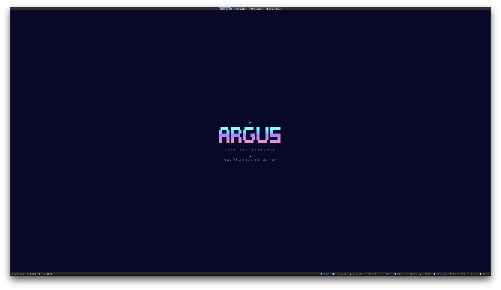
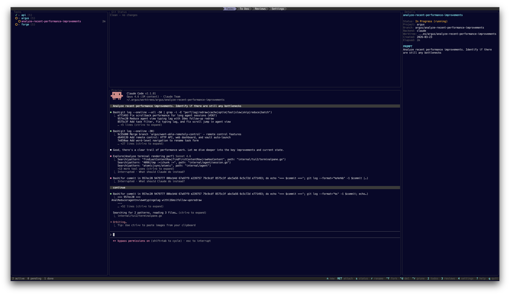
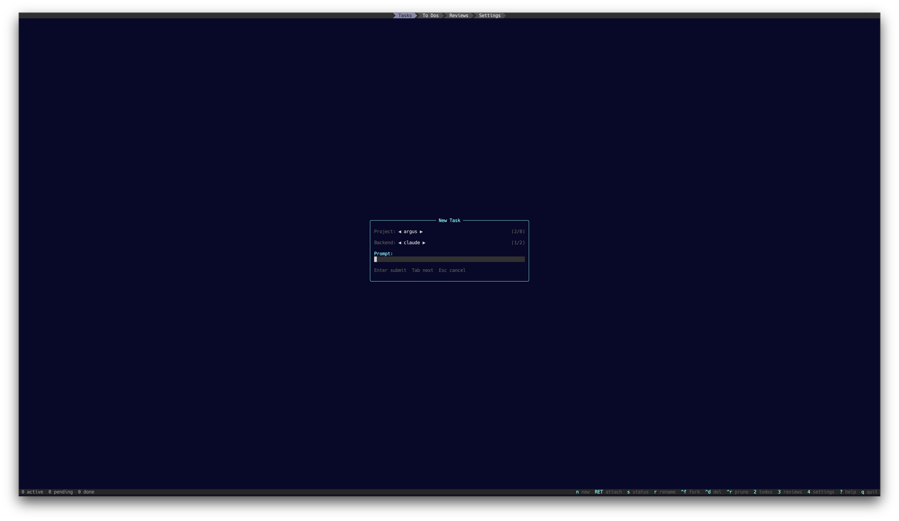
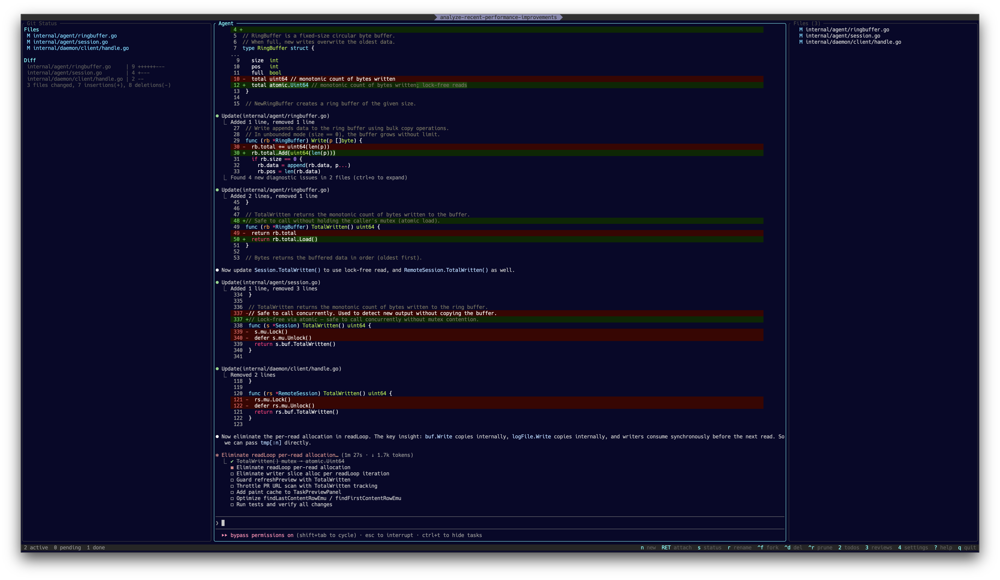
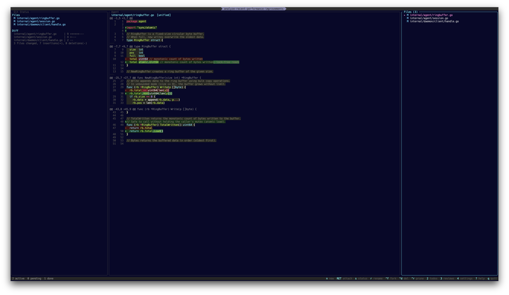
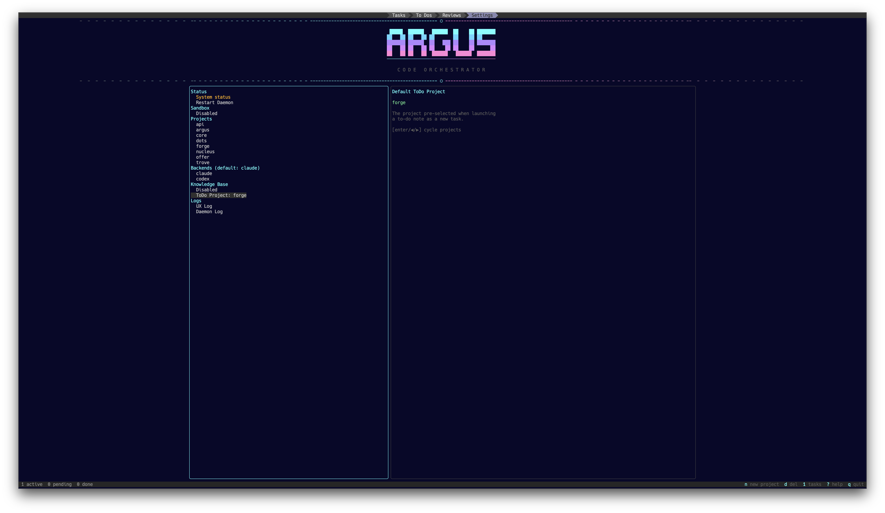

<p align="center"></p>

# Argus

Every agent at a glance. Built with [tcell](https://github.com/gdamore/tcell) and [tview](https://github.com/rivo/tview).

A terminal-native LLM code orchestrator. Manage multiple Claude Code / Codex sessions with task tracking, git worktree isolation, and keyboard-driven workflow.

## Screenshots

<p align="center">
  
</p>

<p align="center">
  
</p>

<p align="center">
  
</p>

<p align="center">
  
</p>

<p align="center">
  
</p>

<p align="center">
  
</p>

## Features

### Agent Management

- **Multi-session orchestration** — Run multiple Claude Code / Codex / custom LLM agents simultaneously with PTY-backed terminal sessions
- **Persistent daemon** — Agent sessions survive TUI restarts via a background daemon that keeps PTY fds alive. Auto-starts on launch, graceful shutdown on exit. Similar to tmux, but purpose-built for agent workflows
- **Session resume** — `--resume` for Claude Code, `codex resume <session-id>` for Codex — conversations survive daemon restarts
- **Configurable backends** — Define command templates for any LLM CLI tool. Per-backend flags, prompt interpolation, and plan mode defaults
- **Skill autocomplete** — `/` in the prompt field triggers autocomplete from `~/.claude/skills/` and per-project skill directories
- **Agent forking** — Duplicate a running or finished task with full context (source info, recent output, git diff) injected into the new agent's worktree

### Task Workflow

- **Task lifecycle** — `pending → in_progress → in_review → complete` with elapsed time tracking, archiving, and batch pruning
- **Collapsible project folders** — Tasks grouped by project with auto-expand/collapse. Archive section at the bottom for completed work
- **Live preview** — ANSI-aware agent output preview in the task list, rendered from the PTY ring buffer
- **Idle detection** — Tasks waiting for input are visually promoted to "in review" status until visited

### Obsidian Integration

- **To Dos tab** — Browse an Obsidian vault as a task inbox. Three-panel view: note list, markdown preview, and metadata
- **Auto-launch from vault** — Select a note, pick a project, optionally add a prompt, and launch it as a new agent task. The note content becomes the agent's instructions
- **Task-note linking** — Each launched task tracks its source vault file. Status badges (○ pending, ● running,  review, ✓ done) show progress inline
- **Vault auto-create** — When enabled, the daemon watches the vault directory for new `.md` files and automatically creates and starts agent tasks. Share a note to Obsidian from your phone, and the agent starts working
- **Cleanup** — `ctrl+r` on the To Dos tab deletes vault files for completed tasks, keeping the inbox clean
- **Knowledge base** — A separate FTS5-powered full-text search store indexes another Obsidian vault and exposes it as an MCP server (port 7742), auto-injected into every agent worktree

### Remote Control

- **HTTP REST API** — Full task management API on port 7743 (configurable). Create tasks, start/stop/resume agents, view output, send input to running agents. Bearer token authentication
- **Mobile web dashboard** — Built-in mobile-first web UI served at `http://<host>:7743/`. Task list with status badges, output viewer with ANSI stripping, create task form, and live agent interaction. Dark theme optimized for phone screens
- **Tailscale-friendly** — API binds `0.0.0.0` for access over Tailscale mesh VPN. No public exposure needed
- **SSE streaming** — Live agent output via Server-Sent Events at `/api/tasks/{id}/stream` with 30s keepalive pings

### Git & Worktrees

- **Worktree isolation** — Each task gets its own worktree at `~/.argus/worktrees/<project>/<task>` with automatic `argus/<task>` branch creation
- **Three-panel agent view** — Git status, agent terminal, and file explorer side by side
- **Inline diff viewer** — Split and unified diff views with syntax highlighting. Navigate files with arrow keys, scroll diffs with `j`/`k`
- **PR URL detection** — Automatically detects PR URLs from agent output. Open in browser with `ctrl+p` or `o`
- **Worktree cleanup** — Destroy tasks to remove worktree, delete local and remote branches in one step

### PR Reviews

- **Review dashboard** — Browse open PRs and review requests across configured repos
- **Diff viewer** — Syntax-highlighted diffs with file navigation
- **Inline actions** — Approve, request changes, or leave line comments directly from the TUI

### Sandbox

- **macOS sandbox-exec** — SBPL profiles for filesystem and credential isolation per agent session
- **Credential protection** — Blocks reads to `~/.ssh`, `~/.gnupg`, `~/.aws`, `~/.kube`, `~/.config/gcloud` by default
- **Per-project config** — Global and per-project sandbox settings with deny-read and extra-write path overrides

### Terminal & Rendering

- **Full PTY emulation** — x/vt terminal emulator with direct cell painting to tcell. Supports colors, attributes (bold, faint, italic, strikethrough), underline styles, and OSC 8 hyperlinks
- **Infinite scrollback** — Live scrollback reads from session log files; ring buffer provides fast follow-tail
- **Bracket paste** — Large text pastes delivered as a single event, not thousands of keystrokes
- **Keyboard scroll acceleration** — Hold Shift+Up/Down for progressive scroll speed

## Install

```bash
go install github.com/drn/argus/cmd/argus@latest
```

## Usage

```bash
argus
```

### Keybindings

#### Task List

| Key | Action |
|-----|--------|
| `n` | New task (with skill autocomplete in prompt field) |
| `Enter` | Open agent view |
| `ctrl+f` | Fork task (duplicate with context) |
| `s` / `S` | Advance / revert status |
| `a` | Toggle archive |
| `p` | Open PR in browser |
| `c` | Copy task prompt to clipboard |
| `ctrl+d` | Destroy task (kill agent + remove worktree + delete branch) |
| `ctrl+r` | Prune completed tasks |
| `j` / `k` | Navigate up/down |
| `1` / `2` / `3` / `4` | Switch tabs (Tasks / To Dos / Reviews / Settings) |
| `q` | Quit |

#### Agent View

| Key | Action |
|-----|--------|
| `ctrl+q` / `Esc` | Back (3-level: diff → files → task list) |
| `Cmd+←` / `Cmd+→` | Switch panels |
| `Cmd+↑` / `Cmd+↓` | Navigate between tasks |
| `ctrl+p` | Open PR in browser |
| `o` | Open PR in browser (when session is finished) |
| `Shift+↑` / `Shift+↓` | Scroll terminal (with acceleration) |

#### File Panel

| Key | Action |
|-----|--------|
| `Enter` | Open diff |
| `s` | Toggle split/unified diff |
| `o` | Reveal in Finder |
| `e` | Open in editor |
| `t` | Open terminal in worktree |

#### To Dos

| Key | Action |
|-----|--------|
| `Enter` | Launch note as task |
| `j` / `k` | Navigate notes |
| `R` | Refresh vault |
| `ctrl+r` | Clean up completed notes |

#### Modals & Forms

| Key | Action |
|-----|--------|
| `Esc` / `ctrl+q` | Close / cancel |
| `Enter` | Confirm / submit |
| `Tab` / `Shift+Tab` | Navigate fields |

#### Reviews

| Key | Action |
|-----|--------|
| `j` / `k` | Navigate PRs |
| `R` | Refresh PR list |
| `a` | Approve PR |
| `r` | Request changes |
| `c` | Line comment |

## Sandbox

Argus can run agent processes inside macOS `sandbox-exec` for filesystem and credential isolation. Each agent session gets an SBPL profile that restricts reads and writes.

### Configuration

Global sandbox settings are managed in the **Settings tab** (`4` key):

| Setting | Description |
|---------|-------------|
| Enabled | Master toggle — applies to all projects by default |
| Deny Read | Extra paths to block reads from (comma-separated) |
| Extra Write | Extra paths to allow writes to (comma-separated) |

Per-project overrides are set in the **project form** (`e` on a project in Settings):

| Setting | Options |
|---------|---------|
| Sandbox | **Inherit** (use global), **Enabled**, or **Disabled** |

Per-project deny-read and extra-write paths are appended to the global lists.

### Built-in defaults

**Filesystem (always denied read):**
- `~/.ssh`, `~/.gnupg`, `~/.aws`, `~/.kube`, `~/.config/gcloud`

**Filesystem (always allowed write):**
- The task's worktree directory
- `/tmp`, `/var/folders`
- `~/.claude.json`, `~/.claude/`
- The main repo's `.git` dir (for worktree git operations)

## Spinner Styles

The in-progress task indicator uses an animated spinner. Cycle through styles in the **Settings tab** using `Enter` or `◀`/`▶` on the **Spinner** row:

| Style | Frames | Speed |
|-------|--------|-------|
| **Progress** (default) | Nerd Font progress icons | 100ms |
| **Dots** | Braille dots `⠋⠙⠹⠸⠼⠴⠦⠧⠇⠏` | 100ms |
| **Braille** | Braille pattern `⣷⣯⣟⡿⢿⣻⣽⣾` | 100ms |
| **Classic** | ASCII `\|/-\\` | 150ms |

## Knowledge Base

Argus includes a built-in FTS5 full-text search store that indexes Obsidian vault markdown files. The KB is exposed as an MCP server (port 7742) and auto-injected into every agent worktree, giving agents access to your notes and documentation.

Configure vault paths in the **Settings tab** under the KB section.

### MCP Tools

The MCP server exposes the following tools to connected agents:

**Knowledge Base:**
| Tool | Description |
|------|-------------|
| `kb_search` | Full-text search with ranked results and snippets |
| `kb_read` | Read full document content by vault-relative path |
| `kb_list` | List documents with optional path prefix filtering |
| `kb_ingest` | Add or update a document in the knowledge base |

**Task Management** (allows agents to orchestrate other agents):
| Tool | Description |
|------|-------------|
| `task_create` | Create a task with worktree and start an agent. Params: `name`, `prompt`, `project` |
| `task_list` | List tasks, filtered by `status` and/or `project` |
| `task_get` | Get task details by `id` |
| `task_stop` | Stop a running agent (moves task to "in review") |

Task management tools enable an external agent (e.g. Claude Code running in another terminal) to programmatically launch and monitor Argus tasks via MCP.

## Remote Control

Argus includes a built-in HTTP API and mobile web dashboard for controlling agents from your phone or any device on your network.

### Setup

1. Enable in the **Settings tab** (`4` key) under **Remote API** — toggle to Enabled
2. Restart the daemon (Settings → Restart Daemon) for the API server to start
3. The API token is auto-generated at `~/.argus/api-token`

### Web Dashboard

Open `http://<your-machine>:7743/` in your phone browser. Enter the API token from `~/.argus/api-token` to authenticate.

The dashboard provides:
- **Task list** — All tasks sorted by status (running first), with project names and elapsed times
- **Task detail** — View agent output (ANSI-stripped), stop/resume/delete agents
- **Send input** — Type commands to running agents directly from your phone
- **Create tasks** — Select a project, enter a prompt, and start a new agent. Skill autocomplete (type `/`) suggests per-project and global skills

The token persists in your browser's localStorage until you clear it.

### REST API

All endpoints require `Authorization: Bearer <token>` header. Token is in `~/.argus/api-token`.

| Method | Endpoint | Description |
|--------|----------|-------------|
| `GET` | `/api/status` | Daemon health, running/idle session counts, task counts by status |
| `GET` | `/api/tasks` | List all tasks. Filter: `?status=in_progress&project=myproj` |
| `POST` | `/api/tasks` | Create and start a task. Body: `{"name":"...", "prompt":"...", "project":"..."}` |
| `GET` | `/api/tasks/{id}` | Get single task detail |
| `POST` | `/api/tasks/{id}/stop` | Stop a running agent (task moves to "in review") |
| `POST` | `/api/tasks/{id}/resume` | Resume a stopped agent |
| `DELETE` | `/api/tasks/{id}` | Delete a task |
| `GET` | `/api/tasks/{id}/output` | Get recent agent output. Optional: `?bytes=65536` (max 1MB) |
| `POST` | `/api/tasks/{id}/input` | Send text to the agent's PTY stdin. Body: raw text |
| `GET` | `/api/tasks/{id}/stream` | SSE stream of live agent output (base64-encoded chunks) |
| `GET` | `/api/projects` | List configured project names |
| `GET` | `/api/skills` | List skills for autocomplete. Filter: `?project=myproj&prefix=dep` |

### Tailscale Access

For secure remote access without exposing ports to the internet:

1. Install [Tailscale](https://tailscale.com) on your machine and phone
2. Enable the API in Argus Settings
3. Access the dashboard at `http://<tailscale-ip>:7743/` from your phone

### Vault Auto-Create

When **Task Sync** is enabled in Settings (under Knowledge Base), the daemon watches your Obsidian vault for new `.md` files and automatically creates agent tasks from them.

1. Enable **Task Sync** in Settings
2. Set your **ToDo Project** (the default project for auto-created tasks)
3. Share a note to your Obsidian vault from your phone (via iOS Share Sheet or any sync method)
4. The daemon detects the new file, creates a worktree, and starts an agent with the note content as the prompt

Files are debounced (500ms) to handle iCloud sync latency. Duplicate detection prevents re-creating tasks for files that already have linked tasks.

### Auto-Start ToDos

When **Auto-Start ToDos** is enabled (press `a` on the Knowledge Base row in Settings), the daemon polls the vault directory on a configurable interval (default: every 2 minutes) and automatically creates and starts tasks for any new `.md` files found. This replaces the fsnotify-based watcher with a more reliable polling approach.

The poll interval can be configured via `kb.auto_start_interval` in the database (value in seconds). Enabling auto-start also implicitly enables Task Sync.

## Data

All state (tasks, projects, backends, keybindings, UI settings, KB index) is persisted in SQLite at `~/.argus/data.sql`.
