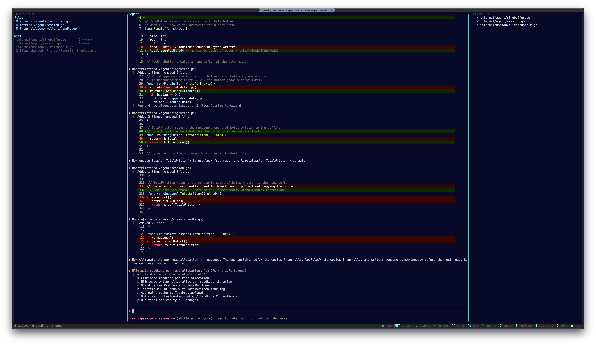

<p align="center"></p>

<h1 align="center">Argus</h1>

<p align="center"><em>Every agent at a glance.</em></p>

<p align="center">
  <a href="https://github.com/drn/argus/actions/workflows/ci.yml"></a>
</p>

Argus is a terminal-native orchestrator for LLM coding agents. Run a swarm of Claude Code and Codex sessions side by side, each in its own git worktree, all under a single keyboard-driven UI — and reach the same swarm from your phone, from another laptop, from another agent, or from your own notes.

<p align="center">
  
</p>

## Why Argus

Coding agents are cheap to start and expensive to babysit. Five `claude` tabs become five forgotten branches. A `codex` you fire off at lunch is a black box until you `cmd-tab` back. Argus replaces that pile of terminals with a persistent orchestrator that knows what every agent is doing, where its worktree lives, when it goes idle, and who needs your attention next.

- **One keystroke** spins up an isolated worktree, a fresh branch, and a fresh agent, all wired into a live dashboard.
- **A persistent daemon** keeps PTYs alive across TUI restarts and laptop reboots. Your sessions outlive your terminal.
- **An idle detector** quietly promotes any agent waiting for input to "in review" — so a glance at the list tells you who needs you.
- **A built-in HTTP API + PWA** mirrors every keystroke from your phone, so the dashboard travels with you.
- **A built-in MCP server** lets agents talk to Argus directly — search your notes, spawn other agents, or hand off work between models.

## The Three Pillars

### 📱 Mobile Dashboard (PWA)

Argus ships a real, installable Progressive Web App. Tap **Add to Home Screen** in Safari and you have a phone-shaped operations console for your agents — running locally on your machine, reachable over your Tailscale mesh, never exposed to the public internet.

<p align="center">
  
</p>

- **Real terminals in the browser** — xterm.js fed by an SSE byte stream, with PTY auto-resize on rotation. Not a polling log viewer.
- **A native compose bar** that catches everything iOS sends — dictation, third-party keyboards, Wispr Flow — and forwards it cleanly into the agent's stdin. Slash-key autocomplete pulls from your `~/.claude/skills/`, per-project skills, and installed plugins.
- **A virtual key bar** with the keys iOS won't give you: Esc, Tab, Shift+Tab (cycle Claude Code modes), arrows. Tap them between dictations without losing the soft keyboard.
- **Web Push notifications** when an agent goes idle. Throttled, VAPID-signed, per-device subscriptions, no third-party push services.
- **Share-sheet target** — Argus shows up natively in the Android share sheet. iOS gets a one-paste Shortcut that does the same. Either way, sharing a URL or a chunk of text into Argus lands you on the New Task tab with the prompt pre-filled.
- **GitHub-style stacked diff view** — every changed file in the worktree as a collapsible panel, expand-all, wrap toggle, optimistic for thumbs.
- **Per-device API tokens** — your iPhone, your iPad, and your laptop each get their own labeled token. Revoke any of them from the dashboard. Master token mints; SHA-256 hashes are all that's stored.
- **Offline-aware** — when the daemon is unreachable (laptop closed, Tailscale off) the PWA flips to a branded offline screen and reconnects automatically.
- **Pure-local** — runs on `localhost` and your Tailscale IP only, never `0.0.0.0`. Hotel/cafe LANs cannot reach the API even with the token.

<p align="center">
  
</p>

### 🤝 Full MCP Server

Argus exposes itself as a Model Context Protocol server, so any agent can drive Argus the same way you do.

- **Spawn other agents.** An orchestrator agent can call `task_create` to fan work out across worktrees, then watch progress with `task_list` and `task_get`.
- **Hand off cleanly.** When a session is done, the agent calls `task_complete` (status flip) or `task_archive` (out of sight) using its own `pwd` to identify itself — no IDs to track.
- **Schedule itself.** `schedule_create` accepts cron, `@every 30m`, or a one-shot `run_once_at` timestamp. An agent can plant a tomorrow-morning follow-up before signing off.
- **Stage clipboard text** with `argus_clipboard_set` — solves the iOS Safari rule that `clipboard.writeText` requires a synchronous user gesture. The agent stages, you tap **Copy** (PWA) or hit `ctrl+y` (TUI). One tap, no escape-character mangling.
- **Rename, fork, stop, resume** — every TUI verb has an MCP equivalent.

The same MCP server is auto-injected into every worktree Argus creates, so newly-spawned agents inherit the toolset without any per-project config.

### 🧠 Knowledge Base

Argus indexes your Obsidian vault as a SQLite FTS5 store and serves it over MCP. Every agent it spawns sees your notes — your design docs, your meeting captures, your durable preferences — as a first-class lookup, not a copy-paste afterthought.

- **`kb_search`** — ranked full-text search across the entire vault, with snippets.
- **`kb_read`** — full markdown by vault-relative path. Wiki-link friendly.
- **`kb_list`** — directory listing with prefix filtering for path-aware browsing.
- **`kb_ingest`** — agents write their own learnings back. Your KB grows from sessions instead of decaying between them.
- **Live re-indexing** — files dropped into the vault are searchable in seconds.
- **Schema-aware** — YAML frontmatter (title + tags) drives retrieval and clustering.

Pair this with the MCP task tools and an agent can read a meeting note, decide what to build, spawn its own worker tasks, and archive itself when done — all in a single conversation.

Disabled by default — see **[Knowledge Base setup](docs/knowledge-base.md)** to enable it, point it at a vault, and verify.

## Also In The Box

- **Remote TUI** — `argus --remote https://your-mac.tail-xxxx.ts.net --token "$ARGUS_TOKEN"` launches the full TUI against a daemon running on another machine. Same keybindings, same panels, same agent stream — over Tailscale. No local SQLite, no daemon socket; every call rides the REST API the PWA already uses.
- **Multi-backend** — Claude Code, Codex, or any LLM CLI as a templated command. Per-backend prompt flags and plan-mode defaults.
- **Worktree isolation** — every task gets `~/.argus/worktrees/<project>/<task>` and an `argus/<task>` branch, all transactionally created and cleaned up.
- **Session resume** — `--resume` on Claude Code, `codex resume <id>` on Codex. Your conversation survives a daemon restart.
- **Consistent scrollback across viewers** — switch between the TUI and the PWA at very different widths and the agent re-emits the conversation at the new size. Idle-gated so it never fires mid-tool-call; the SPA reattaches transparently.
- **Agent forking** — duplicate a running task with full context (source info, recent output, git diff) injected into the new worktree.
- **Smart auto-naming** — a Claude Haiku call quietly turns a free-form prompt into a kebab-case task name. Falls open to a regex slug if `claude` is unavailable.
- **Scheduled tasks** — cron, descriptors, intervals, or one-shot runs. Each fire spawns a fresh task. Manage from TUI, PWA, or MCP.
- **macOS sandbox-exec** — per-session SBPL profiles. `~/.gnupg`, `~/.aws`, `~/.kube`, `~/.config/gcloud` blocked by default.
- **Self-update** — `git pull` + `go install` + daemon restart from a single Settings row. Active sessions reattach across the swap.
- **Auto-start at login** — install the daemon as a launchd LaunchAgent so your agents survive reboots without launching the TUI.
- **Full PTY emulation** — `charmbracelet/x/vt` painting cells directly to `tcell`. Colors, attributes, OSC 8 hyperlinks, infinite scrollback, bracket paste.

## Install

```bash
go install github.com/drn/argus/cmd/argus@latest
argus
```

Pure Go, no CGO. SQLite via `modernc.org/sqlite`. Built with [tcell](https://github.com/gdamore/tcell) and [tview](https://github.com/rivo/tview).

```bash
argus daemon install   # macOS — auto-start at login via launchd
```

To open the PWA, enable **Remote API** in Settings, then point your phone at `http://<your-machine>:7743/` and paste the master token from `~/.argus/api-token`. Tailscale recommended.

---

## Reference

The sections below are the dense usage docs — keybindings, REST endpoints, configuration tables. Skim if you're getting started; bookmark if you're already running.

### Keybindings

#### Task List

| Key       | Action                                                          |
| --------- | --------------------------------------------------------------- |
| `n`       | New task (with skill autocomplete in prompt field)              |
| `Enter`   | Open agent view                                                 |
| `ctrl+f`  | Fork task (duplicate with context)                              |
| `s` / `S` | Advance / revert status                                         |
| `a`       | Toggle archive                                                  |
| `P`       | Toggle pin (★ section pinned to the top of the task list)       |
| `c`       | Copy task prompt to clipboard                                   |
| `ctrl+d`  | Destroy task (kill agent + remove worktree + delete branch)     |
| `ctrl+o`  | Open the project's GitHub repo in browser (via `gh repo view --web`) |
| `ctrl+r`  | Prune completed tasks                                           |
| `j` / `k` | Navigate up/down                                                |
| `1` / `2` | Switch tabs (Tasks / Settings)                                  |
| `ctrl+l`  | Refresh screen (wipe ghost cells; works in every non-agent tab) |
| `q`       | Quit                                                            |

#### Agent View

| Key                   | Action                                                                    |
| --------------------- | ------------------------------------------------------------------------- |
| `ctrl+q` / `Esc`      | Back (3-level: diff → files → task list)                                  |
| `Cmd+←` / `Cmd+→`     | Switch panels (no-op when zoomed — side panels are hidden)                |
| `Cmd+↑` / `Cmd+↓`     | Navigate between tasks                                                    |
| `ctrl+k`              | Open task switcher (fuzzy-search all tasks by name; tasks needing input pinned to the top) |
| `ctrl+z`              | Toggle the git + file side panes (default layout set by Settings → Appearance → "Default agent view") |
| `ctrl+l`              | Open link picker (fuzzy search all session URLs)                          |
| `ctrl+r`              | Switch Claude session (searchable picker of this task's conversations; resumes the chosen one). Claude backends only |
| `ctrl+p`              | Open PR for the worktree branch in browser (via `gh pr view --web`)       |
| `ctrl+y`              | Copy agent-staged text (only when payload pending; otherwise sent to PTY) |
| `Shift+↑` / `Shift+↓` | Scroll terminal (with acceleration)                                       |

#### File Panel

| Key     | Action                    |
| ------- | ------------------------- |
| `Enter` | Open diff                 |
| `s`     | Toggle split/unified diff |
| `f`     | Reveal in Finder          |
| `o`     | Open file (default app)   |
| `t`     | Open terminal in worktree |

#### Modals & Forms

| Key                 | Action           |
| ------------------- | ---------------- |
| `Esc` / `ctrl+q`    | Close / cancel   |
| `Enter`             | Confirm / submit |
| `Tab` / `Shift+Tab` | Navigate fields  |

#### Settings

| Key                   | Action                                                   |
| --------------------- | -------------------------------------------------------- |
| `j` / `k`             | Navigate rows                                            |
| `n`                   | New project / backend / schedule                         |
| `e`                   | Edit project / backend / schedule                        |
| `d`                   | Delete project / set default backend / delete schedule   |
| `t`                   | Toggle schedule enabled (on the Scheduled Tasks section) |
| `r`                   | Run schedule now (on the Scheduled Tasks section)        |
| `i`                   | Quick add projects                                       |
| `Enter` / `◀` / `▶` | Toggle / cycle settings                                  |

### Remote TUI

```bash
argus --remote https://mbp-2026.tail1efd7.ts.net --token "$ARGUS_TOKEN"
```

Launches the TUI pointed at a remote argus daemon instead of the local one. No local SQLite is opened, no daemon socket is contacted — every persistence call goes through the REST API the daemon already serves on port 7743 (the same surface the PWA uses). `--token` falls back to `ARGUS_TOKEN`.

A few local-only operations gracefully degrade in remote mode: spawning a fresh task via the new-task form, forking, schedule fires, and prune-completed all require local worktree access. The status bar surfaces the equivalent REST endpoint when these are attempted remotely. Everything else — task list, attach, input, resize, archive/rename/status flips, settings, DAG, links — works identically against the remote.

### Self-Update

From the **Settings tab** (Status section, when the daemon is connected) the **Source path** row holds the path to your local Argus checkout, and the **Update Argus** row runs `git pull --ff-only` followed by `go install ./...` and then restarts the daemon so the new binary takes over. Active sessions reattach across the restart. The same controls are exposed in the web UI under **Settings → Argus update** (master token only).

### Auto-start at Login (macOS)

Toggle from **Settings → Status → Auto-start at login** (Enter), or use the CLI:

```bash
argus daemon install     # write ~/Library/LaunchAgents/com.drn.argus.daemon.plist and bootstrap into launchd
argus daemon uninstall   # bootout and remove the plist
argus daemon status      # show plist path + installed/loaded state
```

The plist is configured with `RunAtLoad` and `KeepAlive { SuccessfulExit = false }`, which means launchd starts the daemon at login and restarts it if it crashes (non-zero exit) — but a clean `argus daemon stop` is honored and won't trigger a respawn. Stdout/stderr are written to `~/.argus/launchd.log`. The plist points at `~/.argus/argusd`, a symlink to the resolved argus binary; reinstalling rewrites the symlink so launchd picks up the new binary on next start. macOS only — Linux/Windows show no toggle.

### Sandbox

Argus can run agent processes inside macOS `sandbox-exec` for filesystem and credential isolation. Each agent session gets an SBPL profile that restricts reads and writes.

Global sandbox settings are managed in the **Settings tab** (`4` key):

| Setting     | Description                                        |
| ----------- | -------------------------------------------------- |
| Enabled     | Master toggle — applies to all projects by default |
| Deny Read   | Extra paths to block reads from (comma-separated)  |
| Extra Write | Extra paths to allow writes to (comma-separated)   |

Per-project overrides are set in the **project form** (`e` on a project in Settings) — **Inherit**, **Enabled**, or **Disabled**. Per-project deny-read and extra-write paths are appended to the global lists.

**Always denied read:** `~/.gnupg`, `~/.aws`, `~/.kube`, `~/.config/gcloud`
**Always allowed write:** the task's worktree directory, `/tmp`, `/var/folders`, `~/.claude.json`, `~/.claude/`, `~/Library/Application Support/Google/Chrome` (Chrome's crashpad writes there regardless of `--user-data-dir`), the main repo's `.git` dir.
**Always allowed (IOKit):** user-client opens (`iokit-open` / `iokit-open-user-client`) — required for headful Chrome (Playwright/Puppeteer), which calls `IOServiceOpen` on `IOPMrootDomain` at startup and SIGSEGVs on the denied open otherwise. The crashpad write rule above is necessary but not sufficient on its own.

### Running inside tmux

argus renders via [tcell](https://github.com/gdamore/tcell) v2.13+ which automatically wraps every frame in DECSET 2026 (Synchronized Output / BSU+ESU) when the terminal claims to be `XTermLike` — tmux's terminfo does. This means the inner application emits an atomic-frame sequence that, when honored, eliminates rendering tearing during fast updates (typing, PTY streaming, cursor nav).

**tmux 3.2+ does not honor those inner sequences by default — you have to opt in.** Without the opt-in, you'll see occasional visual artifacts (stale cells, partial frames) during rapid screen updates. Add this to `~/.tmux.conf`:

```tmux
set -g default-terminal "tmux-256color"
set -as terminal-features ',xterm*:sync'
```

Reload tmux config (`Prefix + :` then `source-file ~/.tmux.conf`, or restart tmux entirely) and the artifacts disappear. This is the same fix used by Claude Code, neovim, kakoune, and other modern tcell/ncurses apps that emit synchronized output.

If you still see visible flashing after this config, that's a different issue — file a bug. argus calls `screen.Sync()` (the only thing that emits `CSI 2J` / clear-screen) in just two places: when you press `Ctrl+L` (manual refresh, one flash expected) and on tmux pane focus regain (recovers from any drift while you were on another window). Every other UI update flows through tcell's diff and should be invisible inside a properly-configured tmux.

### Spinner Styles

Cycle through styles in the **Settings tab** using `Enter` or `◀`/`▶` on the **Spinner** row:

| Style                  | Frames                     | Speed |
| ---------------------- | -------------------------- | ----- |
| **Progress** (default) | Nerd Font progress icons   | 100ms |
| **Dots**               | Braille dots `⠋⠙⠹⠸⠼⠴⠦⠧⠇⠏`  | 100ms |
| **Braille**            | Braille pattern `⣷⣯⣟⡿⢿⣻⣽⣾` | 100ms |
| **Classic**            | ASCII `\|/-\\`             | 150ms |

### MCP Tools

Argus runs an MCP server on port 7742 and auto-injects it into every agent worktree.

**Knowledge Base:**

| Tool        | Description                                        |
| ----------- | -------------------------------------------------- |
| `kb_search` | Full-text search with ranked results and snippets  |
| `kb_read`   | Read full document content by vault-relative path  |
| `kb_list`   | List documents with optional path prefix filtering |
| `kb_ingest` | Add or update a document in the knowledge base     |
| `kb_delete` | Remove a document by vault-relative path           |

**Task Management** (lets agents orchestrate other agents):

| Tool                   | Description                                                                                                                                                        |
| ---------------------- | ------------------------------------------------------------------------------------------------------------------------------------------------------------------ |
| `task_create`          | Create a task with worktree and start an agent. Params: `name`, `prompt`, `project`. Orchestration: `base_branch`, `depends_on`, `plan_slug`, `upsert`.            |
| `task_list`            | List tasks, filtered by `status` and/or `project`. Returned task objects include `plan_slug` for DAG-view filtering.                                               |
| `task_get`             | Get task details by `id`                                                                                                                                           |
| `task_stop`            | Stop a running agent (moves task to "in review")                                                                                                                   |
| `task_archive`         | Archive or unarchive a task. Pass `cwd` (from the agent's `pwd`) to resolve by worktree, or `id`. Omit `archived` to toggle.                                       |
| `task_rename`          | Rename a task. Updates only the display name (branch and worktree paths stay locked to the original slug). Pass `cwd` or `id` plus `name`.                         |
| `task_complete`        | Mark a task as complete (sets status, stamps `EndedAt`). Pass `cwd` or `id`. Does NOT stop a running agent — call `task_stop` first if needed.                     |
| `task_link`            | Add a dependency edge. Params: `child_id`, `parent_id`. Cycle attempts return the offending path so the UI can render `"A → B → A"`.                               |
| `task_unlink`          | Remove a dependency edge. Params: `child_id`, `parent_id`. No-op when the edge does not exist.                                                                     |
| `task_deps`            | Return one-hop upstream + downstream neighbours of a task. Used by the DAG view's task detail panel.                                                               |
| `task_halt_downstream` | Cascade stop/archive through every transitive descendant of a task. Used after a milestone fails so the rest of the stack doesn't waste effort. Seed is untouched. |
| `task_set_plan_slug`   | Stamp the orchestrator grouping label. Opaque to the daemon; tasks sharing the same slug render as one stack in the DAG view.                                      |
| `task_set_result`      | Persist an opaque JSON result blob the orchestrator can read (PR URL, milestone, failure reason). Pass `cwd` or `id` plus `result`. Up to 64 KiB.                  |

Sample skills at `.claude/skills/archive/SKILL.md` and `.claude/skills/argus-complete/SKILL.md` let an agent finalize its own task at the end of a session via `cwd` resolution. Completing and archiving are independent axes.

**Inter-Task Messaging** (peer-to-peer between live or paused tasks):

| Tool                | Description                                                                                                                                                                                                                                              |
| ------------------- | -------------------------------------------------------------------------------------------------------------------------------------------------------------------------------------------------------------------------------------------------------- |
| `task_message_send` | Send a peer-to-peer message. Params: `to`, `body`, optional `kind` (`note` / `question` / `answer`), optional `in_reply_to`. Caller resolved via `cwd` or `id`. Body ≤ 64 KiB. Recipient inbox capped at 500 unread; sender rate-limited to 50/min.      |
| `task_inbox`        | Read messages addressed to the caller, oldest-first. Filters: `unread_only` (default true), `sender`, `since` (RFC3339), `limit` (default 50, max 500). Does NOT auto-mark read.                                                                         |
| `task_message_ack`  | Mark messages read. Pass `message_ids` (up to 500). IDs not addressed to the caller are silently ignored.                                                                                                                                                |
| `task_ask`          | Convenience: send a question and optionally block until a reply lands. Params: `to`, `body`, optional `timeout_seconds` (default 0 = return immediately; max 120). When blocking, polls the answer at 500 ms cadence; callers wanting longer waits poll. |

If the recipient has a live agent session the daemon also writes a single notification line into their PTY (best-effort). Same surface available over REST: `GET /api/tasks/{id}/inbox`, `POST /api/tasks/{id}/inbox/ack`, `POST /api/tasks/{id}/messages`.

**Schedule Management:**

| Tool               | Description                                                                                                                                                                                               |
| ------------------ | --------------------------------------------------------------------------------------------------------------------------------------------------------------------------------------------------------- |
| `schedule_list`    | List all schedules with name, project, cron expression, enabled state, next/last fire timestamps                                                                                                          |
| `schedule_create`  | Create. Params: `name`, `project`, `prompt`, plus exactly one of `schedule` (cron or `@every <duration>`) or `run_once_at` (RFC3339 UTC); optional `backend`, `enabled`                                   |
| `schedule_update`  | Partial update — pass `id` plus any fields to change. Toggling `enabled`, rotating prompts, or converting between cron and one-shot (set the new field; the other clears automatically).                  |
| `schedule_delete`  | Remove a schedule by `id`. Tasks already created by previous fires are unaffected.                                                                                                                        |
| `schedule_run_now` | Fire a schedule immediately, out of cycle. Bookkeeping is updated so the next regular tick will not double-fire. One-shot rows auto-disable. Does NOT send a push notification — only cron-tick fires do. |

**Agent-Staged Clipboard:**

| Tool                  | Description                                                                                                                                                                     |
| --------------------- | ------------------------------------------------------------------------------------------------------------------------------------------------------------------------------- |
| `argus_clipboard_set` | Stage text for the user to copy with one tap (PWA Copy button) or one keypress (TUI `ctrl+y`). Params: `text` (required), `id` or `cwd`. Last-write-wins, 5-min TTL, 1 MiB max. |

### Remote Control: REST API

All endpoints require auth — `Authorization: Bearer <token>` header or `?token=<token>` query param (the latter is required for `EventSource`/SSE because browsers cannot set headers on it). The token can be the master token from `~/.argus/api-token` or any non-revoked device token.

Every authenticated token has the same permissions **except** a small master-only denylist: **backends CRUD** (command templates can run arbitrary code), **self-update** (`/api/source-path`, `/api/update`), and **token list/mint/revoke** (`/api/tokens`). Those endpoints return `403` for device tokens; everything else — tasks, projects, schedules, settings, messages, push — accepts any token. One extra carve-out lives inside `PUT /api/settings`: the **`sandbox` section is master-only** (it governs the host sandbox-exec boundary), while KB/API/UX-defaults are open.

#### Tasks

| Method   | Endpoint                    | Description                                                                                                                                                                                                                                                                      |
| -------- | --------------------------- | -------------------------------------------------------------------------------------------------------------------------------------------------------------------------------------------------------------------------------------------------------------------------------- |
| `GET`    | `/api/status`               | Running/idle session counts, task counts by status                                                                                                                                                                                                                               |
| `GET`    | `/api/tasks`                | List tasks. Filters: `?status=`, `?project=`, `?archived=1` (or `=all`). Each task carries `idle: true` when `in_progress` but the session is missing or waiting for input.                                                                                                      |
| `POST`   | `/api/tasks`                | Create and start a task. JSON `{"name", "prompt", "project", "backend?"}`, OR `multipart/form-data` with `name`/`prompt`/`project`/`backend` plus `files` parts (uploaded into `<worktree>/.context/`, paths appended to the prompt). Per-file 10MB / total 50MB / 20 files cap. |
| `GET`    | `/api/tasks/{id}`           | Get single task detail (includes `archived`, `worktree_path`, `prompt`, `idle`)                                                                                                                                                                                                  |
| `POST`   | `/api/tasks/{id}/stop`      | Stop a running agent (moves to `in_review`)                                                                                                                                                                                                                                      |
| `POST`   | `/api/tasks/{id}/resume`    | Resume a stopped agent                                                                                                                                                                                                                                                           |
| `DELETE` | `/api/tasks/{id}`           | Delete a task                                                                                                                                                                                                                                                                    |
| `POST`   | `/api/tasks/{id}/archive`   | Archive (hidden from default list)                                                                                                                                                                                                                                               |
| `POST`   | `/api/tasks/{id}/unarchive` | Restore from archive                                                                                                                                                                                                                                                             |
| `POST`   | `/api/tasks/{id}/rename`    | `{"name":"..."}`                                                                                                                                                                                                                                                                 |
| `POST`   | `/api/tasks/{id}/fork`      | Clone to a new task. Body: `{"name?", "prompt?", "project?"}`                                                                                                                                                                                                                    |
| `POST`   | `/api/tasks/{id}/status`    | Set status. Body: `{"status":"in_review"\|"complete"\|"pending"\|"in_progress"}`                                                                                                                                                                                                 |

#### Sessions / terminal

| Method | Endpoint                 | Description                                                                                                                                                                                                                                                                                                                 |
| ------ | ------------------------ | --------------------------------------------------------------------------------------------------------------------------------------------------------------------------------------------------------------------------------------------------------------------------------------------------------------------------- |
| `GET`  | `/api/tasks/{id}/output` | Recent output (text). Optional `?bytes=`, `?clean=1`                                                                                                                                                                                                                                                                        |
| `GET`  | `/api/tasks/{id}/links`  | Extract http/https URLs from terminal output. Returns `{"links":[{"label","url"}]}`. Powers the PWA's "Open link" overflow item.                                                                                                                                                                                            |
| `POST` | `/api/tasks/{id}/input`  | Send raw bytes to PTY stdin                                                                                                                                                                                                                                                                                                 |
| `POST` | `/api/tasks/{id}/upload` | Upload files mid-session. `multipart/form-data` with `files` parts; saved to `<worktree>/.context/<name>` (auto-suffixed on collision) and returns `{paths:[]}`. Same 10MB/50MB/20-file caps as create.                                                                                                                     |
| `GET`  | `/api/tasks/{id}/stream` | SSE stream of live output (base64-encoded chunks)                                                                                                                                                                                                                                                                           |
| `GET`  | `/api/tasks/{id}/size`   | Current PTY dimensions: `{cols, rows}`                                                                                                                                                                                                                                                                                      |
| `POST` | `/api/tasks/{id}/resize` | Resize PTY: `{"cols":N,"rows":M}`. Returns `{cols,rows,rerendered}` — `rerendered:true` means the resize crossed the rerender margin (≥15 col delta from session-start width) and the daemon queued a kill+resume so the agent re-emits scrollback at the new width. The SPA's exit-event handler reattaches automatically. |
| `POST` | `/api/sessions/stop-all` | Stop every running session                                                                                                                                                                                                                                                                                                  |

#### Git status / diff / files

| Method | Endpoint                               | Description                                             |
| ------ | -------------------------------------- | ------------------------------------------------------- |
| `GET`  | `/api/tasks/{id}/git/status`           | git status output + branch diff for the task's worktree |
| `GET`  | `/api/tasks/{id}/git/diff?path=<file>` | Unified diff for a single file                          |
| `GET`  | `/api/tasks/{id}/files?dir=<rel>`      | Worktree file listing                                   |

#### Projects & backends (full CRUD)

| Method   | Endpoint               | Description                                                                                                                                                                         |
| -------- | ---------------------- | ----------------------------------------------------------------------------------------------------------------------------------------------------------------------------------- |
| `GET`    | `/api/projects`        | List project names                                                                                                                                                                  |
| `GET`    | `/api/projects/full`   | List with path, branch, default_backend                                                                                                                                             |
| `POST`   | `/api/projects`        | Create. Body: `{"name", "path", "branch?", "backend?", "sandbox?"}` where `sandbox` is `{"enabled": true\|false\|null, "deny_read":[], "extra_write":[]}` (`null` = inherit global) |
| `PUT`    | `/api/projects/{name}` | Update                                                                                                                                                                              |
| `DELETE` | `/api/projects/{name}` | Delete                                                                                                                                                                              |
| `GET`    | `/api/backends`        | List with command + prompt_flag                                                                                                                                                     |
| `POST`   | `/api/backends`        | Create. **Master token required** (command templates can run arbitrary code).                                                                                                       |
| `PUT`    | `/api/backends/{name}` | Update. **Master token required.**                                                                                                                                                  |
| `DELETE` | `/api/backends/{name}` | Delete. **Master token required.**                                                                                                                                                  |
| `GET`    | `/api/skills`          | Skill autocomplete. Filter: `?project=`, `?filter=` (case-insensitive substring)                                                                                                    |

#### Push notifications (Web Push, VAPID)

| Method   | Endpoint                     | Description                                                                    |
| -------- | ---------------------------- | ------------------------------------------------------------------------------ |
| `GET`    | `/api/push/vapid-public-key` | VAPID public key (urlsafe base64) for `pushManager.subscribe()`                |
| `POST`   | `/api/push/subscribe`        | Register a subscription. Body: `{"label","endpoint","keys":{"p256dh","auth"}}` |
| `GET`    | `/api/push/subscriptions`    | List with masked endpoints                                                     |
| `DELETE` | `/api/push/subscribe/{id}`   | Unsubscribe                                                                    |
| `POST`   | `/api/push/test`             | Fan out a test notification to every device                                    |

The daemon polls running sessions every 5s; when a session transitions to idle, every subscription receives a notification (throttled to 1 per task per 5 min). Subscriptions returning `410 Gone` are auto-pruned.

#### Per-device API tokens

| Method   | Endpoint           | Description                                                                                                                         |
| -------- | ------------------ | ----------------------------------------------------------------------------------------------------------------------------------- |
| `GET`    | `/api/tokens`      | List tokens with last-4 + label                                                                                                     |
| `POST`   | `/api/tokens`      | Mint a new device token. **Master token required.** Body: `{"label":"My iPhone"}` → `{"id","label","token"}` (plaintext shown once) |
| `DELETE` | `/api/tokens/{id}` | Revoke. **Master token required.**                                                                                                  |

Tokens are stored as SHA-256 hashes; plaintext is never persisted on the server.

#### Scheduled tasks

| Method   | Endpoint                  | Description                                                                                                                                           |
| -------- | ------------------------- | ----------------------------------------------------------------------------------------------------------------------------------------------------- |
| `GET`    | `/api/schedules`          | List schedules with `next_run_at`, `last_run_at`, `last_task_id`, `last_error`. |
| `POST`   | `/api/schedules`          | Create. Body: `{"name","project","prompt","schedule","backend?","enabled"}`. Returns the created row. |
| `PUT`    | `/api/schedules/{id}`     | Partial update — every field optional. Useful for toggling `enabled`. |
| `DELETE` | `/api/schedules/{id}`     | Remove. Tasks already created by the schedule are not affected. |
| `POST`   | `/api/schedules/{id}/run` | Fire the schedule now, regardless of cron timing. Returns `{"task_id"}`. |

Schedule expressions accept the standard 5-field cron syntax (e.g. `0 9 * * 1-5`), descriptors (`@hourly`, `@daily`, `@weekly`, `@monthly`, `@yearly`), and intervals (`@every 30m`).

#### Settings & logs

| Method | Endpoint                         | Description                                                                                                                                  |
| ------ | -------------------------------- | -------------------------------------------------------------------------------------------------------------------------------------------- |
| `GET`  | `/api/settings`                  | Returns sandbox / KB / API / defaults config plus `sandbox.available` (whether `sandbox-exec` is on this host).                              |
| `PUT`  | `/api/settings`                  | Partial update — every section is optional. Body: `{"sandbox":{...}, "kb":{...}, "api":{...}, "defaults":{...}}`. The `sandbox` section is **master token required**; other sections accept any token. |
| `GET`  | `/api/logs/{ux\|daemon}?bytes=N` | Tail the last N bytes of the log (default 64K, max 1M). Missing files return `200` with empty body.                                          |

### Keep the host awake

The daemon runs as a normal process on the host machine. When the host sleeps, HTTP responses stall, SSE streams disconnect, and push notifications stop firing. PTY sessions pause where they were and resume when the host wakes.

For a clamshell-mode laptop driving an external display:

- Use `caffeinate -is` (no `-d`) or [KeepingYouAwake](https://github.com/newmarcel/KeepingYouAwake) with **Allow display sleep** enabled — keeps system + idle awake while letting the display sleep.
- For a permanent setup on AC power: `sudo pmset -c sleep 0 disablesleep 1 displaysleep 1`.
- Sleeping the external display via `pmset displaysleepnow` (or a hot corner) is fine; physically disconnecting it will sleep the Mac because the lid is closed.

### Tailscale Access

For secure remote access without exposing ports to the internet:

1. Install [Tailscale](https://tailscale.com) on your machine and phone
2. Enable the API in Argus Settings
3. Access the dashboard at `http://<tailscale-ip>:7743/` from your phone

When the PWA cannot reach the API — daemon stopped, host asleep, or Tailscale off — it flips to an offline screen with the Argus banner and a Tailscale reminder, then auto-reconnects once the daemon is reachable again.

### Data

All state (tasks, projects, backends, keybindings, UI settings, KB index) is persisted in SQLite at `~/.argus/data.sql`.

### Config file (`~/.argus/config.toml`)

An optional `~/.argus/config.toml` overrides any setting, layered on top of the built-in defaults and the SQLite-backed settings (precedence: **defaults < settings menu < `config.toml`**). It's the alacritty-style power-user layer — customize beyond what the settings menu exposes, and keep your config in version control. The file is optional; a missing file changes nothing. Edits are picked up live on the next read.

Behavior notes:

- **The file wins over the settings menu** — any key present here masks changes you make in Settings. That's intentional.
- **Unknown or misspelled keys are silently ignored** (the file stays forward-compatible), so check the spelling against the tables below if an override seems to do nothing.
- **A malformed file is ignored** — logged to `~/.argus/ux.log` (or `~/.argus/daemon.log` when the daemon reads it) — and Argus falls back to the defaults + settings-menu values until the file parses again.
- **Maps merge by key.** `[backends.<name>]` / `[projects.<name>]` add a new key or replace an existing one *wholesale* — a partial entry zeroes the fields you omit (it can blank a project's `path`), so define those entries in full.

Every option below is overridable. A ⚠️ marks options that are **read but not yet honored** — they're persisted and accepted by the file, but no code consumes them yet (key remapping and theming are planned; see the table notes).

#### `[defaults]`

| Key | Type | Default | Description |
|-----|------|---------|-------------|
| `backend` | string | `"claude"` | Backend used for a new task when none is chosen in the New Task form. Must name a key under `[backends]`. |
| `share_project` | string | `""` | Project preselected in the New Task form when the PWA share target (iOS/Android share sheet) lands a payload. Empty falls back to the currently expanded project folder. |
| `permission_mode` | string | `"bypass-active"` | Permission flags injected into Claude-style backends at launch. One of `default`, `acceptEdits`, `plan`, `bypass-allow`, `bypass-active`. |

#### `[backends.<name>]`

Command templates, keyed by name. Seeded with `claude`, `codex`, and `pi`.

| Key | Type | Default | Description |
|-----|------|---------|-------------|
| `command` | string | — | Executable plus base flags for the agent CLI (e.g. `claude`, `codex --dangerously-bypass-approvals-and-sandbox`). Permission flags come from `defaults.permission_mode` and are **not** baked in here. |
| `prompt_flag` | string | `""` | Flag used to pass the initial prompt to the backend (empty = positional/piped). |

#### `[projects.<name>]`

Registered repos, keyed by name. The DB projects table is the primary source; entries here override it.

| Key | Type | Default | Description |
|-----|------|---------|-------------|
| `path` | string | — | Absolute path to the git repository. |
| `branch` | string | — | Base branch new worktrees fork from. |
| `backend` | string | — | Per-project backend override; falls back to `defaults.backend`. |

`[projects.<name>.sandbox]` — per-project sandbox overrides. **These untagged fields match by lowercased Go name, not snake_case** (`denyread`, not `deny_read`):

| Key | Type | Default | Description |
|-----|------|---------|-------------|
| `enabled` | bool | inherit | Override the global sandbox on/off for this project (omit to inherit `sandbox.enabled`). |
| `denyread` | []string | `[]` | Extra paths appended to the global deny-read list for this project. |
| `extrawrite` | []string | `[]` | Extra writable paths appended to the global list. |
| `allowappleevents` | []string | `[]` | Extra AppleEvent destination bundle IDs allowed for this project. |

#### `[ui]`

| Key | Type | Default | Description |
|-----|------|---------|-------------|
| `spinner_style` | string | `"progress"` | Spinner animation: `progress`, `dots`, `braille`, or `classic`. |
| `default_agent_zoom` | bool | `true` | Resting agent-view layout: `true` opens single-pane/zoomed (side panels collapsed); `false` opens the 1:3:1 three-pane layout. `Ctrl+Z` toggles at runtime. |
| `theme` | string | `"default"` | ⚠️ Color theme name. Only `default` exists today and nothing reads this yet — reserved for a future theming layer. |
| `show_elapsed` | bool | `true` | ⚠️ Reserved — show elapsed time on task rows. Not yet consumed. |
| `show_icons` | bool | `true` | ⚠️ Reserved — show status icons. Not yet consumed. |
| `cleanup_worktrees` | bool | `true` | ⚠️ Reserved — auto-remove worktrees on task delete. Not yet consumed (worktrees are currently always cleaned up). |

#### `[keybindings]` ⚠️

All keybindings are **reserved**: they're loaded into config but the TUI key routing is still hardcoded, so setting them has no effect yet. This is the "more robust config backend → remap hotkeys" work that's planned, not shipped.

| Key | Type | Default | Description |
|-----|------|---------|-------------|
| `new` | string | `"n"` | New task. |
| `attach` | string | `"enter"` | Attach to / open the selected task's agent. |
| `status` | string | `"s"` | Advance task status. |
| `delete` | string | `"d"` | Delete task. |
| `quit` | string | `"q"` | Quit. |
| `help` | string | `"?"` | Help overlay. |
| `filter` | string | `"/"` | Filter the task list. |
| `prompt` | string | `"p"` | Open the prompt modal. |
| `worktree` | string | `"w"` | Worktree action. |

#### `[sandbox]`

macOS `sandbox-exec` (SBPL) controls for agent processes.

| Key | Type | Default | Description |
|-----|------|---------|-------------|
| `enabled` | bool | `false` | Wrap agent processes in a per-session SBPL profile. |
| `deny_read` | []string | `[]` | Paths denied read access, on top of the always-denied `~/.gnupg`, `~/.aws`, `~/.kube`, `~/.config/gcloud`. |
| `extra_write` | []string | `[]` | Additional writable paths. |
| `allow_apple_events` | []string | `[]` | CFBundleIdentifiers allowed as AppleEvent destinations (e.g. `com.apple.iChat`) — required to script Messages/Finder from a sandboxed agent. |

#### `[kb]`

| Key | Type | Default | Description |
|-----|------|---------|-------------|
| `enabled` | bool | `false` | Run the knowledge-base MCP server. |
| `http_port` | int | `7742` | KB server port. |
| `metis_vault_path` | string | iCloud Metis vault | Obsidian vault indexed for the KB. |

Full enable/verify walkthrough: **[docs/knowledge-base.md](docs/knowledge-base.md)**.

#### `[api]`

| Key | Type | Default | Description |
|-----|------|---------|-------------|
| `enabled` | bool | `false` | Run the HTTP REST API + PWA for remote control. |
| `http_port` | int | `7743` | API port (binds `127.0.0.1` + the Tailscale IP only — never `0.0.0.0`). |

#### `[argus]`

| Key | Type | Default | Description |
|-----|------|---------|-------------|
| `source_path` | string | `""` | Local clone of the Argus repo used by the self-update (`go install`) flow. |

#### Example

```toml
[defaults]
backend = "claude"
permission_mode = "bypass-active"

[ui]
spinner_style = "braille"
default_agent_zoom = true

# Maps merge by key; an existing key is replaced wholesale, so list every
# field you want to keep.
[backends.claude]
command = "claude"
prompt_flag = ""

[projects.argus]
path = "/Users/me/code/argus"
branch = "master"

[projects.argus.sandbox]
enabled = true
denyread = ["~/.ssh"]   # note: lowercased, not deny_read

[sandbox]
enabled = false
deny_read = ["~/.gnupg", "~/.aws"]

[api]
enabled = true
http_port = 7743
```
