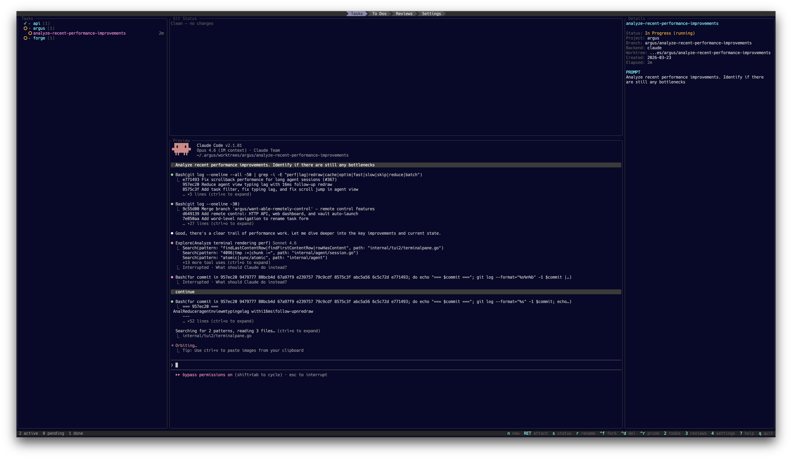
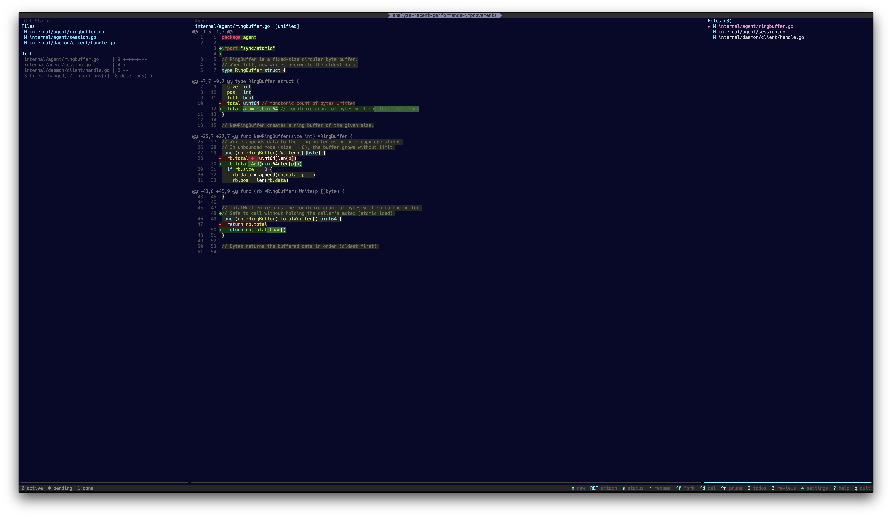
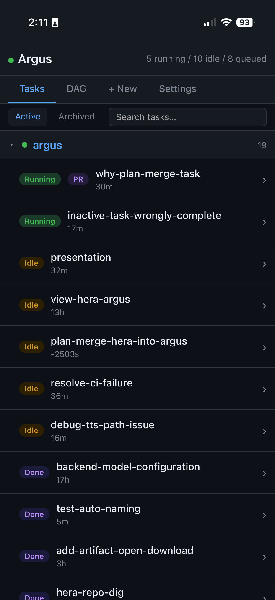
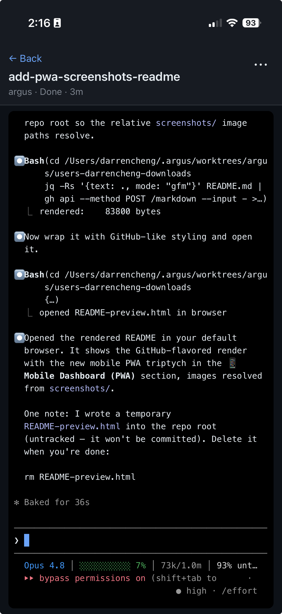
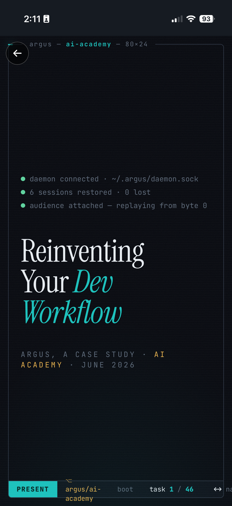
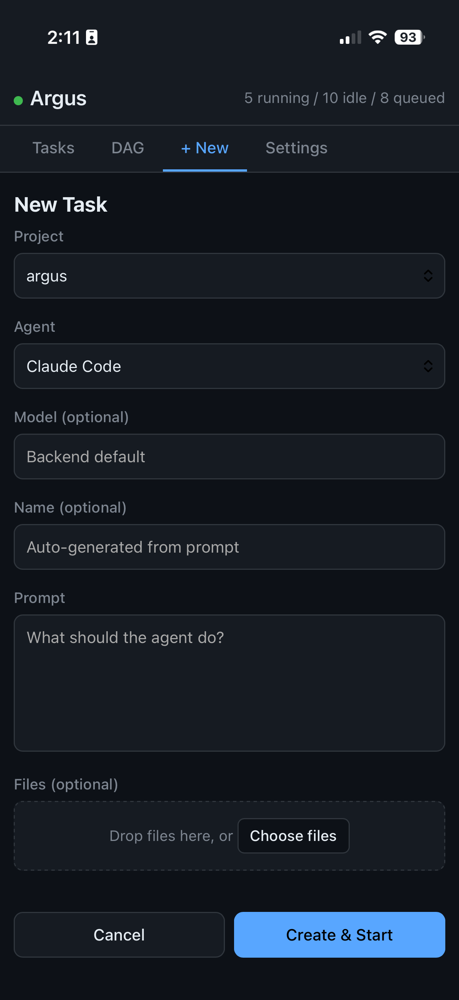
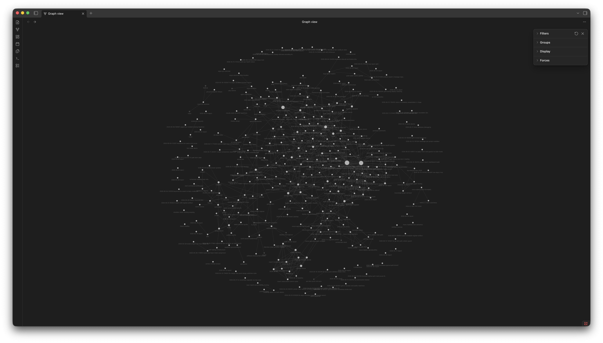

<p align="center"></p>

<h1 align="center">Argus</h1>

<p align="center"><em>Every agent at a glance.</em></p>

<p align="center">
  <a href="https://github.com/drn/argus/actions/workflows/ci.yml"></a>
</p>

Argus is a terminal-native orchestrator for LLM coding agents. Run a swarm of agents — Claude Code, Codex, or any LLM CLI, cloud or local — side by side, each in its own git worktree, all under a single keyboard-driven UI — and reach the same swarm from your phone, from another laptop, from another agent, or from your own notes.

<p align="center">
  
  &nbsp;
  
</p>

## Why Argus

Coding agents are cheap to start and expensive to babysit. Five `claude` tabs become five forgotten branches. A `codex` you fire off at lunch is a black box until you `cmd-tab` back. Argus replaces that pile of terminals with a persistent orchestrator that knows what every agent is doing, where its worktree lives, when it goes idle, and who needs your attention next.

- **One keystroke** spins up an isolated worktree, a fresh branch, and a fresh agent, all wired into a live dashboard.
- **Native multi-agent coordination.** A dedicated **Hera** tab turns one agent into a team: a coordinator delegates to workers it spawns, an idle-gated message bus passes work between them, and a live plan DAG shows the whole team's order of work at a glance — all first-class in the same UI, no separate tool.
- **A persistent daemon** keeps PTYs alive across TUI restarts and laptop reboots — and a separate session-supervisor keeps them alive across *daemon* restarts too, so you can upgrade Argus mid-flight without interrupting a single agent. Your sessions outlive your terminal.
- **An idle detector** quietly promotes any agent waiting for input to "in review" — so a glance at the list tells you who needs you.
- **A built-in HTTP API + PWA** mirrors every keystroke from your phone, so the dashboard travels with you.
- **A built-in MCP server** lets agents talk to Argus directly — search your notes, spawn other agents, or hand off work between models.
- **Harness- and model-agnostic by design.** Argus orchestrates the workflow, not a single tool. Every backend is just a templated command, so the same worktree → branch → review → notify loop is identical whether the agent underneath is Claude Code, Codex, opencode, or a local model via ollama — pick the harness and model per task, keep one standardized workflow across all of them.

## One daemon, three clients

Argus is really a **local daemon** plus the clients that drive it. The daemon owns everything durable — your tasks and projects in SQLite, the agent PTYs in its session-supervisor, hera coordination in-process — and serves it all over one authenticated REST + SSE API on port 7743. Every client is a thin lens over that same API, so they stay in lockstep: start a task in the terminal, watch it go idle on your phone, review the diff on your Mac. Reach for whichever one fits where you are.

### 🖥️ Terminal TUI — the keyboard-driven daily driver

The original surface, and the one you'll live in: a full-screen `tcell`/`tview` dashboard (the two screenshots up top) with real PTY emulation, inline diffs, and a chord for every verb. **Reach for it** when you're already in a terminal — over SSH, inside tmux, on the box where the repos live. `argus --remote` gives you the identical TUI against a daemon on another machine.

### 📱 Web app / PWA — the swarm in your pocket

Argus ships a real, installable Progressive Web App. Tap **Add to Home Screen** in Safari and you have a phone-shaped operations console for your agents — running locally on your machine, reachable over your Tailscale mesh, never exposed to the public internet. **Reach for it** from any device you didn't bring the terminal to — your phone on the couch, a borrowed laptop — and let Web Push tap you on the shoulder when an agent needs you.

<p align="center">
  
  &nbsp;
  
  &nbsp;
  
  &nbsp;
  
</p>

- **Real terminals in the browser** — xterm.js fed by an SSE byte stream, with PTY auto-resize on rotation. Not a polling log viewer.
- **A native compose bar** that catches everything iOS sends — dictation, third-party keyboards, Wispr Flow — and forwards it cleanly into the agent's stdin. Slash-key autocomplete pulls from your `~/.claude/skills/`, per-project skills, and installed plugins.
- **A virtual key bar** with the keys iOS won't give you: Esc, Tab, Shift+Tab (cycle Claude Code modes), arrows. Tap them between dictations without losing the soft keyboard.
- **Web Push notifications** when an agent goes idle. Throttled, VAPID-signed, per-device subscriptions, no third-party push services.
- **Share-sheet target** — Argus shows up natively in the Android share sheet. iOS gets a one-paste Shortcut that does the same. Either way, sharing a URL or a chunk of text into Argus lands you on the New Task tab with the prompt pre-filled.
- **GitHub-style stacked diff view** — every changed file in the worktree as a collapsible panel, expand-all, wrap toggle, optimistic for thumbs.
- **Per-device API tokens** — your iPhone, your iPad, and your laptop each get their own labeled token. Revoke any of them from the dashboard. Master token mints; SHA-256 hashes are all that's stored.
- **Offline-aware** — when the daemon is unreachable (laptop closed, Tailscale off) the PWA flips to a branded offline screen and reconnects automatically.
- **Pure-local** — runs on `localhost` and your Tailscale IP only, never `0.0.0.0`. Hotel/cafe LANs cannot reach the API even with the token.

### 🖥️ macOS app — native point-and-click mission control

A native SwiftUI app (`make mac-app`) that turns the same daemon into a Mac-first control room — no browser tab, no keyboard chords to memorize. A source-list sidebar of tasks grouped into per-project folders (mirroring the TUI task list, with a collapsed Archived section at the bottom), a live agent terminal powered by SwiftTerm, and detail tabs for the session, the diff, the file tree, and task info. **Reach for it** when you're at your Mac and want the OS working for you: native notifications when an agent needs input or goes idle, a **Dock badge** counting how many are waiting, and a **menu-bar extra** for a glance without switching windows.

- **Full task lifecycle** — create (a project / backend / model / prompt sheet), fork, stop, restart, resume, rename, archive, and delete, each with native confirmations.
- **Live everything** — the task list and every terminal update ride the daemon's SSE event stream, not polling; a connection banner appears the moment the daemon is unreachable.
- **Diff & files tabs** — a unified diff with per-file collapsible sections and a browsable worktree file tree, parsed client-side by ArgusKit.
- **Schedules & System windows** — manage scheduled tasks (⇧⌘S) and watch host load / agent-session counts, the same data the TUI and PWA show.
- **Hera roster** — the orchestration tree, read-only (see the parity note in the Reference).
- **Keychain-backed remote settings** — point it at any daemon by overriding the server URL; the token lives in the macOS Keychain, never on disk. Defaults to `http://127.0.0.1:7743` with the token from `~/.argus/api-token`.

Requires macOS 15+ and the Swift 6.3 Command Line Tools — no Xcode. Build and run details are in the [macOS app](#macos-app) reference below.

## Built for agents, too

### 🤝 Full MCP Server

Argus exposes itself as a Model Context Protocol server, so any agent can drive Argus the same way you do.

- **Spawn other agents.** An orchestrator agent can call `task_create` to fan work out across worktrees, then watch progress with `task_list` and `task_get`.
- **Hand off cleanly.** When a session is done, the agent calls `task_complete` (status flip) or `task_archive` (out of sight) using its own `pwd` to identify itself — no IDs to track.
- **Schedule itself.** `schedule_create` accepts cron, `@every 30m`, or a one-shot `run_once_at` timestamp. An agent can plant a tomorrow-morning follow-up before signing off.
- **Stage clipboard text** with `argus_clipboard_set` — solves the iOS Safari rule that `clipboard.writeText` requires a synchronous user gesture. The agent stages, you tap **Copy** (PWA) or hit `ctrl+y` (TUI). One tap, no escape-character mangling.
- **Rename, fork, stop, resume** — every TUI verb has an MCP equivalent.

The same MCP server is auto-injected into every worktree Argus creates, so newly-spawned agents inherit the toolset without any per-project config.

### 🧠 Knowledge Base

Argus indexes your Obsidian vault as a SQLite FTS5 store and serves it over MCP. Every agent it spawns sees your notes — your design docs, your meeting captures, your durable preferences — as a first-class lookup, not a copy-paste afterthought.

<p align="center">
  
</p>

- **`kb_search`** — ranked full-text search across the entire vault, with snippets.
- **`kb_read`** — full markdown by vault-relative path. Wiki-link friendly.
- **`kb_list`** — directory listing with prefix filtering for path-aware browsing.
- **`kb_ingest`** — agents write their own learnings back. Your KB grows from sessions instead of decaying between them.
- **Live re-indexing** — files dropped into the vault are searchable in seconds.
- **Schema-aware** — YAML frontmatter (title + tags) drives retrieval and clustering.

Pair this with the MCP task tools and an agent can read a meeting note, decide what to build, spawn its own worker tasks, and archive itself when done — all in a single conversation.

Disabled by default — see **[Knowledge Base setup](docs/knowledge-base.md)** to enable it, point it at a vault, and verify.

## Also In The Box

- **Remote TUI** — `argus --remote https://your-mac.tail-xxxx.ts.net --token "$ARGUS_TOKEN"` launches the full TUI against a daemon running on another machine. Same keybindings, same panels, same agent stream — over Tailscale. No local SQLite, no daemon socket; every call rides the REST API the PWA already uses.
- **Multi-backend** — Claude Code, Codex, or any LLM CLI as a templated command. Per-backend prompt flags, plan-mode defaults, and a default model, plus a per-task model override injected as `--model` at launch.
- **Worktree isolation** — every task gets `~/.argus/worktrees/<project>/<task>` and an `argus/<task>` branch, all transactionally created and cleaned up.
- **Session resume** — `--resume` on Claude Code, `codex resume <id>` on Codex, `--session <id>` on opencode. Your conversation survives a daemon restart.
- **Consistent scrollback across viewers** — switch between the TUI and the PWA at very different widths and the agent re-emits the conversation at the new size. Idle-gated so it never fires mid-tool-call; the SPA reattaches transparently.
- **Agent forking** — duplicate a running task with full context (source info, recent output, git diff) injected into the new worktree.
- **Smart auto-naming** — a Claude Haiku call quietly turns a free-form prompt into a kebab-case task name. Falls open to a regex slug if `claude` is unavailable.
- **Scheduled tasks** — cron, descriptors, intervals, or one-shot runs. Each fire spawns a fresh task. Manage from TUI, PWA, or MCP.
- **macOS sandbox-exec** — per-session SBPL profiles. `~/.gnupg`, `~/.aws`, `~/.kube`, `~/.config/gcloud` blocked by default.
- **Session-supervisor** — agent PTYs live in a long-lived out-of-process supervisor, not the daemon, so bouncing the daemon (for an upgrade or a config change) re-attaches to still-running agents instead of killing them. On by default; one flag rolls back to the legacy in-process runner.
- **Self-update** — `git pull` + `go install` + daemon restart from a single Settings row. Active sessions reattach across the swap.
- **Auto-start at login** — install the daemon as a launchd LaunchAgent so your agents survive reboots without launching the TUI.
- **Full PTY emulation** — `charmbracelet/x/vt` painting cells directly to `tcell`. Colors, attributes, OSC 8 hyperlinks, infinite scrollback, bracket paste.

## Install

```bash
go install github.com/drn/argus/cmd/argus@latest
argus
```

Pure Go, no CGO. SQLite via `modernc.org/sqlite`. Built with [tcell](https://github.com/gdamore/tcell) and [tview](https://github.com/rivo/tview).

```bash
argus daemon install   # macOS — auto-start at login via launchd
```

To open the PWA, enable **Remote API** in Settings, then point your phone at `http://<your-machine>:7743/` and paste the master token from `~/.argus/api-token`. Tailscale recommended.

## Getting Started

### Prerequisites

- **Go 1.26+** — to `go install` the binary above.
- **Git** — every project Argus drives must be a git repository.
- **At least one agent CLI on your `PATH`.** Argus shells out to whatever backend you pick; it doesn't bundle a model. The default backend is **Claude Code** (`claude`), and `codex`, `pi`, and `opencode` come pre-configured too. Install the one you use and make sure it runs from a plain shell (`claude --version`).
- **Optional:** [`gh`](https://cli.github.com) (GitHub CLI) powers the open-repo / open-PR keys and the PR-status indicator — features degrade quietly if it's absent. [Tailscale](https://tailscale.com) is recommended for reaching the PWA from your phone.

### First run

```bash
argus
```

The first launch creates `~/.argus/data.sql`, seeds the `claude` / `codex` / `pi` / `opencode` backends, and auto-starts the background daemon. You land on an empty task list — **no projects are seeded, so add one before creating a task.**

1. **Register a project.** Press `3` for the **Settings** tab, move to the **Projects** section, and either:
   - press `i` to **quick-add** — point it at a directory (e.g. `~/src`) and Argus scans for git repos; select the ones to import; or
   - press `n` to add one **manually** — give it a name and the absolute path to the repo root (base branch and backend are optional; they fall back to git's default and `claude`).
2. **Create your first task.** Press `1` for the **Tasks** tab, then `n`. Pick the project, type a prompt, and hit `Enter`. Argus cuts a fresh worktree at `~/.argus/worktrees/<project>/<task>` on an `argus/<task>` branch, starts the agent, and drops you into the agent view with its live terminal.
3. **Drive it.** `Enter` reopens an agent, `s` advances status, `ctrl+z` toggles the git/file side panes, `ctrl+q` steps back out. The full keymap is in the [Keybindings](#keybindings) reference below.
4. **Go mobile (optional).** Enable **Remote API** in Settings and open the PWA as described under [Install](#install).

---

## Reference

The sections below are the dense usage docs — keybindings, REST endpoints, configuration tables. Skim if you're getting started; bookmark if you're already running.

### Keybindings

The tables below are the **defaults**. Every key here is remappable via
`[keybindings.<context>]` in `config.toml` — see [`[keybindings.<context>]`](#keybindingscontext)
below. The `?` overlay always shows your active bindings.

#### Task List

| Key       | Action                                                          |
| --------- | --------------------------------------------------------------- |
| `n`       | New task (with skill autocomplete in prompt field)              |
| `Enter`   | Open agent view                                                 |
| `ctrl+f`  | Fork task (duplicate with context)                              |
| `s` / `S` | Advance / revert status                                         |
| `a`       | Toggle archive                                                  |
| `P`       | Toggle pin (★ section pinned to the top of the task list)       |
| `c`       | Open copy menu (copy task name or prompt to clipboard)          |
| `r`       | Rename task (display name only; branch/worktree stay locked)    |
| `H`       | Toggle visibility of Hera-managed tasks (workers + coordinators; visible inline by default, each with a hera-role indicator — press `H` to hide) |
| `ctrl+d`  | Destroy task (kill agent + remove worktree + delete branch)     |
| `ctrl+o`  | Open the project's GitHub repo in browser (via `gh repo view --web`) |
| `ctrl+r`  | Prune completed tasks                                           |
| `j` / `k` | Navigate up/down                                                |
| `1` / `2` / `3` | Switch tabs (Tasks / Projects / Settings) |
| `ctrl+l`  | Refresh screen (wipe ghost cells; works in every non-agent tab) |
| `ctrl+j`  | Open the unified **task/role switcher** (see the Agent View table below — same global action, also reachable from the plain Task List) |
| `ctrl+k`  | Open the **command palette** — type to filter the actions applicable right here (this tab/pane's own actions + the always-available globals), `↑`/`↓` to select, `Enter` runs it immediately. Works from every tab and pane, including inside the agent view and a live Projects-tab pane |
| `ctrl+g`  | Jump directly to the next role needing input (no popup, no typing) — press again to cycle to the next one, wrapping around. The rail's fold/selection state is snapshotted the instant you're first interrupted; once every role is clear, pressing `ctrl+g` again restores that snapshot instead of just saying there's nothing to do. Works from every tab and pane |
| `ctrl+b`  | Restore the rail to its pre-interruption fold/selection snapshot, at any time — even with roles still needing input (unlike `ctrl+g` above, which only restores once they're all clear). No-op if nothing is snapshotted. Works from every tab and pane |
| `q`       | Quit                                                            |

#### Agent View

| Key                   | Action                                                                    |
| --------------------- | ------------------------------------------------------------------------- |
| `ctrl+q`              | Back, 3-level (diff → files panel → task list)                            |
| `Esc`                 | Refocus terminal from diff/files; on the terminal, forwarded to the agent (does NOT exit the agent view) |
| `Cmd+←` / `Cmd+→`     | Switch panels (no-op when zoomed — side panels are hidden)                |
| `Cmd+↑` / `Cmd+↓`     | Navigate between tasks                                                    |
| `ctrl+j`              | Open the unified **task/role switcher** (fuzzy-search all tasks AND Hera-managed roles by name; entries needing input are pinned to the top, so an empty-filter `Enter` jumps straight to the first one). Selecting a Hera-managed entry switches to the Projects tab and lands on it there (expanding any folded ancestor coordinator first) instead of opening the classic per-task view |
| `ctrl+k`              | Open the command palette (see the Task List table above — same global action) |
| `ctrl+g`              | Jump directly to the next role needing input — no popup, no typing, independent of the switcher above (see the Task List table above — same global action) |
| `ctrl+b`              | Restore the rail's pre-interruption fold/selection snapshot at any time (see the Task List table above — same global action) |
| `ctrl+z`              | Toggle the git + file side panes (default layout set by Settings → Appearance → "Default agent view") |
| `ctrl+l`              | Open link picker (fuzzy search all session URLs)                          |
| `ctrl+r`              | Switch Claude session (searchable picker of this task's conversations; resumes the chosen one). Claude backends only |
| `ctrl+p`              | Open PR for the worktree branch in browser (via `gh pr view --web`)       |
| `ctrl+y`              | Copy agent-staged text; flashes "Nothing to copy" if no payload is pending (always intercepted — never sent to the PTY) |
| `Shift+↑` / `Shift+↓` | Scroll terminal (with acceleration)                                       |

#### Projects Tab

The Projects tab (`2`) has three regions: a left **rail**, a middle **coordinator pane**, and a right **details** region. The rail lists active orchestrators with their coordinator/worker roles, plus **Pinned**, **Freelance**, and a collapsed **Archive** section. A live worker or freelance role's row also carries a trailing **context-pressure indicator** – nothing under 40% of `worker_context_window` (default `1000000` – a worker's real context window, deliberately separate from the coordinator's much smaller recycle-nudge budget below), a `•` warming from pale yellow to hot orange through 40–90%, then a red `!` past 90% (see [Context-budget Stop hook](#context-budget-stop-hook)); coordinators show a plain live-role count in that spot instead, since they already have the Stop hook's own budget/recycle guard. Every TOP-LEVEL coordinator also carries an independent **kanban status** (`active` / `backlog` / `blocked` / `done`, default `active`) — the active list is grouped by it, in that order, each group with its own labeled divider (an empty group renders nothing). Only the group holding the current rail selection is expanded; the other three collapse to their header line, and stepping past a group's edge transparently expands the next one. This is fully independent of pin/archive and of the `s`/`S` role-status keys below. Keys act on the rail selection:

| Key             | Action                                                                                 |
| --------------- | -------------------------------------------------------------------------------------- |
| `j` / `k`       | Move the rail cursor down / up                                                          |
| `Space`         | Collapse / expand an orchestrator, or the Freelance / Archive section                  |
| `/`             | Filter the rail by name (substring, ancestry-preserving); `↑`/`↓` navigate the filtered rows while typing, `Enter` accepts, `Esc` clears |
| `Tab`           | Enter a pane from the rail. **Once a terminal pane is focused, `Tab` / `Shift+Tab` pass through to the agent's PTY** so its autocomplete works (e.g. `/plugi`+`Tab` → `/plugin`) — they no longer cycle focus |
| `ctrl+alt+←` / `ctrl+alt+→` | Move focus between panes once you're in one (the focus ladder; `Tab` is reserved for the agent there). `ctrl+q` steps back to the rail |
| `ctrl+z`        | Fullscreen the focused content pane (rail stays; the other pane hides). Also traps `^Z` so it can never suspend the pane's agent |
| `ctrl+j`        | Open the unified task/role switcher — works from the rail AND from a focused pane (never reaches the PTY). See the Agent View table above |
| `ctrl+k`        | Open the command palette — works from the rail AND from a focused pane (never reaches the PTY; this replaces the old raw pass-through of `ctrl+k` into a pane). From a pane its rows also include that pane's own fullscreen/copy actions |
| `ctrl+g`        | Jump directly to the next role needing input, cycling on repeat (wraps around) — works from the rail AND from a focused pane (never reaches the PTY). See the Agent View table above |
| `ctrl+b`        | Restore the rail's pre-interruption fold/selection snapshot at any time — works from the rail AND from a focused pane (never reaches the PTY). See the Agent View table above |
| `ctrl+y`        | Copy the agent-staged clipboard payload for the **focused pane's** task (coordinator or worker) — the Projects view shows several tasks at once, so the copy is scoped to whichever pane has focus. Always steals the key (the pane's title shows `(ctrl+y copy)` when a payload is staged); flashes "Nothing to copy" otherwise — never falls through to the PTY |
| `Enter`         | Enter the selected role's pane, reviving its session first — a dead session is restarted, and a suspended/stuck worker is resumed in place via `--session-id` |
| `w`             | Spawn a worker under the selected coordinator (opens the full new-task modal: project / branch / backend / model / prompt, project defaulted to the coordinator's) |
| `n`             | Create a new top-level coordinator (same new-task modal); bootstraps a fresh orchestrator + `coord` role bound to a new task. Works on an empty rail |
| `r`             | Rename the selected role / orchestrator                                                 |
| `a`             | **Hide** the selected worker / sub-coordinator into its parent coordinator's nested archive (Tier 1): reversible toggle, **keeps the session + worktree alive**, no confirm. A top-level coordinator has no parent archive, so `a` is a feedback no-op there |
| `P`             | Pin / unpin the selected role / orchestrator                                            |
| `s` / `S`       | Advance / revert the selected **Hera role** status (`idle → working → blocked → done`)  |
| `m` / `M`       | Advance / revert the selected **top-level coordinator's** kanban status (`active → backlog → blocked → done`, wrapping); a no-op on a role, a nested/bridged sub-coordinator, or an empty selection |
| `J`             | Adopt a freelancer into, or re-parent a coordinator under, a chosen orchestrator (type-to-filter picker) |
| `B`             | On a **coordinator**: **Force-recycle** (confirm): kill its session and restart it immediately on the same task/worktree/branch, no idle wait — the human-forced counterpart to the coordinator's own self-service recycle (see [Context-budget Stop hook](#context-budget-stop-hook)). On a **worker or freelance role**: **Bounce** (confirm): send its live session an instruction to call `hera_status(handoff_note=..., request_recycle=true)` itself — the same self-service recycle then restarts it in place once it goes idle and makes that call. No kill/restart happens directly from the key; no fallback if the role never responds. No-op on an empty selection |
| `c`             | **Clear** the selected coordinator's archive (confirm): NUKE every Tier-1 hidden agent under it — reclaim their worktrees + branches, archive their tasks, remove them from the rail (rows retained for DB recovery). Scoped to the selected coordinator, never global |
| `C`             | **Cleanup**: open the merge-safety review popup over the full stuck-task backlog across every project (Tier A + Tier B classification, daemon-side) and immediately clean the chosen scope (row/worktree/branch). Selection-independent — works regardless of the rail cursor |
| `ctrl+d`        | **Nuke** the selected role; on a coordinator / orchestrator header (or a nested sub-coordinator row), cascade the whole subtree — every nested sub-coordinator + their agents (Tier 2). Nuke **removes the rows from the rail entirely** (a `nuked_at` mark — no DB deletes; role / orchestrator / inbox / task rows all retained and recoverable via the DB) and reclaims the worktree + branch + session. On a single (sole-bound) role this opens the merge-safety review popup (Tier A, local-only) instead of a plain confirm — NOT-SAFE/SAFE sections, `Clean safe`/`Clean all`/`Cancel`, never a hard block; a cascade keeps its existing count-bearing confirm, augmented with a confirmed-merged count. A task bound live in another orchestrator is preserved. (vs `a`, which hides but keeps the worktree/session) |
| `←`             | Move to parent coordinator (rail focused only — passes through to the PTY when a pane is focused) |
| `Cmd+↑` / `Cmd+↓` | Move the rail cursor up / down without changing the focused pane (the mod-7 escape sequence is consumed — the pane's PTY never sees it) |
| `ctrl+q`        | Return focus to the rail                                                                |

When a **worker** is selected the details region shows its live agent terminal. When a **coordinator** is selected it stacks a read-only roster of that orchestrator's roles — a compact table (status, name, diligence archetype, resolved model; ready-to-close/PR fold into the status cell), scrollable via `PgUp`/`PgDn` when it has more agents than the panel can show — over the embedded **plan DAG** — the planned + live worker roles laid out by their `hera_blocks` dependency order (the plan the coordinator authored over the `hera_plan*` MCP tools), with same-stage siblings auto-collapsed into parallel groups and a master-detail header above the diagram. Both render at once, no toggle; the plan graph is the interactive surface (a coordinator with no authored plan shows its live roles flat with a "no plan" hint):

| Key (plan DAG)       | Action                                                                            |
| -------------------- | --------------------------------------------------------------------------------- |
| `↑` / `↓` / `j` / `k` | Move between plan stages (collapses any fanned-out group on the way) — always the plan graph's, never the Agents roster above it |
| `PgUp` / `PgDn`       | Scroll the Agents roster when it has more agents than fit — its own dedicated keys, so they never compete with the plan graph's stage nav |
| `←` / `→` / `h` / `l` | Move between slots; inside a fanned-out group, walk its members                   |
| `Space`              | Fan out / collapse a parallel group — a pure toggle that never opens a node (on a lone leaf it is a no-op; opening is `Enter`'s job) |
| `Enter`              | Fan out a collapsed group; on a fanned-out group **member**, a sub-coordinator node, or a plain leaf, open that node: drill into a sub-coordinator's child orchestrator's plan, else jump to that node's role within the Projects view (selects it in the rail + focuses its agent pane — no tab switch), reviving a dead/suspended session just like the rail's `Enter`. On a member it does **not** collapse the group — that's `Space` / `Esc` |
| `Esc`                | Back out one level: collapse a fanned group, else drill out to the parent plan (consumed at the root — leave the pane via `Ctrl+Q` / `Tab`) |

End-of-life has **two resting states**, and **no DB row is ever hard-deleted** — "done with" always means gone from the rail + worktree gone from disk, with the role / orchestrator / inbox / task all retained and recoverable: **Hide** (`a`, Tier 1) nests a worker / sub-coordinator in its parent coordinator's archive and keeps its session + worktree alive (reversible — un-hide restores it exactly); **Nuke** (`ctrl+d`, Tier 2; or `C` for a coordinator's whole archive) removes the row from the rail entirely, reclaims its worktree + branch, and stops its session, leaving only the DB rows behind. Every nuke is confirm-gated and honors multi-binding isolation (a task bound live under another orchestrator is never touched).

#### File Panel

| Key     | Action                    |
| ------- | ------------------------- |
| `Enter` | Open diff                 |
| `s`     | Toggle split/unified diff |
| `f`     | Reveal in Finder          |
| `o`     | Open file (default app)   |
| `e`     | Open in editor (`$EDITOR`) |
| `t`     | Open terminal in worktree |

#### Modals & Forms

| Key                 | Action           |
| ------------------- | ---------------- |
| `Esc` / `ctrl+q`    | Close / cancel   |
| `Enter`             | Confirm / submit |
| `Tab` / `Shift+Tab` | Navigate fields  |

#### Settings

| Key                   | Action                                                   |
| --------------------- | -------------------------------------------------------- |
| `j` / `k`             | Navigate rows                                            |
| `n`                   | New project / backend / schedule                         |
| `e`                   | Edit project / backend / schedule                        |
| `d`                   | Delete project / set default backend / delete schedule   |
| `a`                   | Edit project's AppleEvents allowlist (on a project row)  |
| `m`                   | Edit backend's default model (on a backend row)          |
| `t`                   | Toggle schedule enabled (on the Scheduled Tasks section) |
| `r`                   | Run schedule now (on the Scheduled Tasks section)        |
| `i`                   | Quick add projects                                       |
| `Enter` / `◀` / `▶` | Toggle / cycle settings                                  |

### Remote TUI

```bash
argus --remote https://mbp-2026.tail1efd7.ts.net --token "$ARGUS_TOKEN"
```

Launches the TUI pointed at a remote argus daemon instead of the local one. No local SQLite is opened, no daemon socket is contacted — every persistence call goes through the REST API the daemon already serves on port 7743 (the same surface the PWA uses). `--token` falls back to `ARGUS_TOKEN`.

A few local-only operations gracefully degrade in remote mode: spawning a fresh task via the new-task form, forking, schedule fires, and prune-completed all require local worktree access. The status bar surfaces the equivalent REST endpoint when these are attempted remotely. Everything else — task list, attach, input, resize, archive/rename/status flips, settings — works identically against the remote.

### macOS app

A native SwiftUI client (`Argus`) built on **ArgusKit**, a typed Swift SDK over the daemon's REST + SSE API. It drives the same daemon as the TUI and the PWA — there is no separate backend.

**Requirements:** macOS 15+ and the **Swift 6.3 Command Line Tools** (`xcode-select --install`). No Xcode or `xcodebuild` needed — the app is a SwiftPM package (`macos/Package.swift`) built entirely from the CLT toolchain. SwiftTerm (the live-terminal widget) is the only third-party dependency; ArgusKit itself is pure Foundation.

| Target          | Command                                        | What it does                                                                                     |
| --------------- | ---------------------------------------------- | ----------------------------------------------------------------------------------------------- |
| `make mac-build` | `swift build --disable-sandbox`               | Compile ArgusKit + Argus.                                                                        |
| `make mac-test`  | `swift run --disable-sandbox ArgusKitTests`   | Run the ArgusKit test suite. **This is the test entry point, not `swift test`** (see below).     |
| `make mac-run`   | `swift run --disable-sandbox Argus`           | Build and launch the app from source.                                                            |
| `make mac-app`   | `./scripts/mac-app.sh`                         | Assemble the double-clickable `macos/dist/Argus.app` (release build + `Info.plist` + codesign) and print the `open` command. |

`--disable-sandbox` is required because macOS forbids nested `sandbox-exec` profiles: when you build from inside an argus agent sandbox (how this repo is dogfooded), SwiftPM's own manifest sandbox fails to apply. The app's own manifest needs no protection from us, so disabling it makes the targets work everywhere.

**Why not `swift test`:** on a CLT-only install (no Xcode) `swift test` builds the `.xctest` bundle but cannot execute it — it silently runs **zero** tests and exits `0`, so even failing tests "pass". The suite is therefore an *executable* swift-testing target (`ArgusKitTests`) run via `make mac-test`, which executes it for real and propagates a correct exit code.

**Launch env hooks** (automation / deep-linking; each read once at startup):

| Variable                | Value                                       | Effect                                                                                          |
| ----------------------- | ------------------------------------------- | ---------------------------------------------------------------------------------------------- |
| `ARGUS_MAC_SELECT_TASK` | task id or exact name                       | Selects that task at launch, overriding the default auto-select.                                |
| `ARGUS_MAC_INITIAL_TAB` | `terminal` \| `diff` \| `files` \| `info`   | Sets the initial detail tab regardless of which task is selected. Unrecognized values ignored.  |

```sh
# run the bundle binary directly — `open` does not pass environment variables through
ARGUS_MAC_SELECT_TASK=my-task ARGUS_MAC_INITIAL_TAB=diff \
  macos/dist/Argus.app/Contents/MacOS/Argus
```

**Settings:** by default the app connects to `http://127.0.0.1:7743` using the master token from `~/.argus/api-token`. To drive a **remote** daemon (e.g. over Tailscale), set a **Server URL override** (stored in `UserDefaults`) and a **token override** in Preferences — the token is written to the macOS **Keychain**, never to disk. Preferences also carries the needs-input / idle notification toggles and the menu-bar-extra toggle.

**Feature surface:**

| Area          | What's there                                                                                              |
| ------------- | -------------------------------------------------------------------------------------------------------- |
| Task rail     | Sidebar of tasks grouped into per-project folders (TUI-parity ordering; Archived collapsed at the bottom), with status icons, needs-input markers, and a live connection indicator. |
| Detail tabs   | **Terminal** (live SwiftTerm session), **Diff** (unified, per-file collapsible), **Files** (worktree tree), **Info**. |
| Lifecycle     | New-task sheet (project / backend / model / prompt), fork, stop, restart, resume, rename, archive, delete — with confirmations. |
| Live updates  | Task list + terminals driven by the SSE event stream; a 30 s safety-net poll; offline/connection banner. |
| Notifications | Native `UNUserNotificationCenter` alerts on needs-input / idle (when not frontmost), a Dock badge counting tasks awaiting you, and an optional menu-bar extra. |
| Windows       | Main window, **Schedules** (⇧⌘S), **System** (host metrics + session counts), and standard **Settings**. |
| Hera          | Read-only orchestration roster (`GET /api/hera`).                                                         |

**Parity note:** the **Hera view is read-only in both the macOS app and the web app** — they render the roster and plan but expose no coordinator mutations (spawn / block / status). Driving a hera team stays **TUI-only** until the hera mutation endpoints are exposed over REST. Everything else — task lifecycle, terminal I/O, diffs, schedules, settings — is at full parity across all three clients.

**Keyboard shortcuts:**

| Shortcut | Action |
| --- | --- |
| ⌘N | New task |
| ⌘R | Rename selected task |
| ⇧⌘S | Schedules window |
| ⌘Q | Quit |
| ⌘1 / ⌘2 / ⌘3 / ⌘4 | Switch detail tab: Terminal / Diff / Files / Info |
| ⇧⌘/ | Shortcuts help sheet |
| ⌘⌫ | Destroy selected task (with confirmation) |
| ⇧⌘B | Fork selected task |
| ⇧⌘E | Open selected task's worktree in Finder |
| ⇧⌘U | Open selected task's PR in the browser — works from the app's global scope and while the Terminal tab has focus |
| ⇧⌘J | Jump to the next task whose session needs input |
| ⇧⌘A | Archive/unarchive selected task |
| ⇧⌘P | Pin/unpin selected task |
| ⌘F | Focus the sidebar's filter field |
| ⌘↑ / ⌘↓ | Previous/next task, while the Terminal tab has focus |
| ⌘← / ⌘→ | Cycle the detail tab, while the Terminal tab has focus |
| ⇧↑ / ⇧↓ / ⇧PageUp / ⇧PageDown / ⇧End | Scroll the terminal's scrollback, while the Terminal tab has focus |
| ⇧⌘C | Copy the terminal's visible output |

The Cmd-modified chords listed as "while the Terminal tab has focus" are intercepted by a local key monitor before they reach the live terminal — they never leak into the agent's input stream. Every other keystroke, including all Ctrl chords, reaches the agent unchanged. Right-clicking a task row also surfaces status-advance/status-revert; the toolbar's "…" overflow menu has "Prune Stale Worktrees"; the sidebar's filter bar has a persistent hera-managed-tasks visibility toggle; and the Terminal tab's toolbar has a button that opens the Claude session switcher (see the REST endpoints above).

### Self-Update

From the **Settings tab** (Status section, when the daemon is connected) the **Source path** row holds the path to your local Argus checkout, and the **Update Argus** row runs `git pull --ff-only` followed by `go install ./...` and then restarts the daemon so the new binary takes over. Active sessions reattach across the restart. The same controls are exposed in the web UI under **Settings → Argus update** (master token only).

### Hera (native multi-agent coordination)

Hera is Argus's native layer for running a *team* of agents. It introduces **roles** — a `coordinator` plus the `worker`s and `freelance`rs it spawns — bound to argus tasks and addressed by name. A coordinator delegates work to workers it spawns (`hera_spawn_worker` / the rail's `w` key), they trade messages over the same idle-gated bus that powers inter-task messaging, and the team's work renders as a **plan DAG** (the planned + live worker roles laid out by their `hera_blocks` dependency order, with sub-coordinator drill-in) folded into the Projects tab's details pane. The whole surface is the second tab (`2`) — see the [Projects Tab](#projects-tab) keybindings above. The coordination layer runs in-process in the daemon; the view renders directly in the TUI. Agents drive it over MCP (the [`hera_*` tools](#mcp-tools)).

**Native Hera and the external Hera plugin are mutually exclusive, selected by `hera.enabled` (default ON):**

- **`hera.enabled = true` (default)** — native Hera is active. It stores its state in the same `~/.argus/data.sql` (the `hera_*` tables), exposes the `hera_*` MCP tools in-process, and owns the second tab. The legacy Hera plugin's tools are suppressed so they never double-register.
- **`hera.enabled = false`** — the native `hera_*` MCP tools are not served, and you can instead run the external **Hera plugin** over the [plugin substrate](#plugin-substrate). The plugin keeps its own `~/.hera` state and plugin view, entirely unaffected by Argus. The TUI's second tab is always the native Hera view regardless of this flag.

The two run **independently and share no state.** Switching to native Hera performs **no migration** of any prior `~/.hera` data – native Hera starts fresh. Set the flag in `config.toml` (`[hera] enabled = …`) or the DB.

#### Context-budget Stop hook

A long-lived coordinator accumulates context for the life of its orchestration in a way a disposable worker never does. `argus coord-hook` is a CLI subcommand meant to run as a Claude Code `Stop` hook: on every turn of **any hera-bound session** (coordinator, worker, or freelance) it self-discovers the daemon's REST port + API token, tails the session transcript for the latest main-chain assistant message's `input_tokens + cache_creation_input_tokens + cache_read_input_tokens` (summed, not `cache_read_input_tokens` alone – a prompt-cache miss collapses that field toward zero even though real context is unchanged or larger), and stamps the total into `task_meta` (`hera`, `context_size`) – this same stamp feeds the Projects tab rail's worker/freelance context-pressure indicator (a `•`/`!` mark on the row, see [Projects Tab](#projects-tab)). Claude Code documents the transcript file as written asynchronously and warns it may lag the turn that just finished at the moment the hook fires – no hook event exposes token usage directly, so the hook re-scans across a short bounded retry window and keeps the largest value seen, but only when a single scan doesn't already match or exceed the task's previously-stamped size (the common case skips the retry entirely, so this isn't a fixed tax on every turn). Only for a **coordinator** role does the hook go further: once that value reaches the project's `coordinator_context_budget` (`[hera] coordinator_context_budget`, default `300000`) it blocks the `Stop` event with a "reach a safe seam and recycle" nudge. The nudge is throttled: it recurs only after `context_size` grows by another `coordinator_nudge_increment` (default `50000`) past the size at which it last fired, or immediately on a fresh over-budget episode following a drop back under budget (typically via a recycle). It self-gates hard on `ARGUS_TASK_ID` plus a resolved hera role of any kind, so it is a silent no-op only for a task with no hera binding at all (or any other Claude Code session on the machine).

Because every Argus-spawned agent inherits the daemon's real `HOME` regardless of which project it's working in, the hook is registered **once, globally** – Argus cannot write to a user's global settings file on their behalf, so this is a one-time manual step. Add to `~/.claude/settings.json`:

```json
{
  "hooks": {
    "Stop": [
      { "hooks": [ { "type": "command", "command": "argus coord-hook" } ] }
    ]
  }
}
```

`argus doctor` checks whether this hook is registered and warns if it's missing – see [Diagnosing binary skew](#diagnosing-binary-skew-argus-doctor) below.

### Diligence profiles (model tiering)

**Diligence profiles** route model choice *per archetype* and vary process rigor *per project*: spend premium models up the tree (plan / orchestrate / review / synthesize), where leverage is high and output is hard to verify; save cheaper models down the tree (CI loops, verification, docs), where work is high-volume and verifiable. A profile is a named, on-disk TOML preset; a project points at one *by name*. At spawn, Argus resolves the bound profile, feeds the per-archetype model into the existing model-resolution chain, and exports the resolution to the agent's environment so the in-repo hera/DAG skill is profile-aware.

#### Archetypes

A task's **archetype** names *what kind of job* it is. It is an optional task property set at the spawn layer – the new-task form, the new-worker prompt, the `hera_spawn_worker` `archetype` param, and plan-DAG nodes – on every spawn path except a new hera coordinator (which is always `orchestrator`). The archetype is the key matched against a profile's `[archetype.<name>]` tables; the selector defaults to `(none)`, meaning no profile is consulted. The thirteen canonical archetypes (and the model the seed `default` profile assigns each):

| Archetype | What it is | `default` model |
|-----------|------------|-----------------|
| `brainstorm` | Exploratory design / ideation | `opus` |
| `orchestrator` | Coordinator that delegates and routes work (default for hera coordinators) | `sonnet` |
| `big_build` | Large, multi-file implementation | `sonnet` |
| `code_slice` | A scoped implementation slice (default for hera workers) | `sonnet` |
| `bug_fix` | A targeted defect fix | `sonnet` |
| `review` | A code / plan review pass | `opus` |
| `security_review` | A security-focused review | `opus` |
| `synthesis` | Consolidating multiple inputs into one result | `sonnet` |
| `spec_audit` | Auditing spec coverage / conformance | `sonnet` |
| `ci_loop` | A mechanical CI-green loop | `haiku` |
| `verify` | Verification / acceptance checking | `haiku` |
| `recovery` | Recovering a stuck or failed task | `sonnet` |
| `docs` | Documentation writing | `haiku` |

#### Model-naming convention

A profile's `model` field uses the backend's **stable CLI aliases**, which always map to the current model, so a profile does not churn per model release. Claude: `opus`, `sonnet`, `haiku`. Codex: `gpt-5-codex`, `gpt-5`. Validation accepts any model in the **union** of these built-in aliases and every configured backend's `models` list – so adding a foreign reviewer model under `[backends.<name>] models` makes it a valid profile model with no Argus code change. A profile model is applied only when it is valid for the worker's *resolved* backend; otherwise resolution falls through (e.g. `opus` named for a codex worker falls open to that backend's default).

#### Profiles

A profile is one TOML file, discovered from two locations:

- `~/.argus/profiles/<name>.toml` – the per-user **library** (fallback).
- `<repo>/.argus/profiles/<name>.toml` – an **in-repo** copy (checked in or gitignored, operator's choice). In-repo **takes precedence** over the library for the same name, so a repo can pin its own profile.

The DB stores **only** the project→profile *name* – never a profile body, and there is no profiles table.

- **`extends`** – a profile may set `extends = "<parent>"`; the child's declared fields overlay onto the fully-resolved parent, recursively and per-field (a field the child omits is inherited). An `extends` cycle is a validation error.
- **`validate` CLI** – `argus validate <name>` loads, resolves, and validates a profile, reporting every conformance error (unknown archetype, out-of-enum `effort`/`window`, unknown model, `extends` cycle) or confirming it is valid and naming the source (in-repo vs library) it resolved from. Exit `0` = valid, `1` = not found / invalid. It is operator tooling only – **not** wired into the Go build, CI, or any Make gate.
- **Seed profiles** – three documented examples ship embedded in the binary (`internal/profiles/seeds/`), installable via **Settings → Hera → "Install Default Profiles"** or `argus profiles install-defaults`; either writes any seed name not already present into `~/.argus/profiles/` and never overwrites an existing (possibly customized) file. Installation is always an explicit action – nothing auto-installs on daemon startup. You can also copy a seed by hand into `~/.argus/profiles/` or a repo's `.argus/profiles/` and adapt it.
  - `default` – balanced allocation across all 13 archetypes (the table above).
  - `lean` – `extends = "default"`, minimal process (single review pass, no gating) for daily-driven personal tooling.
  - `customer_grade` – `extends = "default"`, turned-up rigor (two review passes, gating, a security spot-check) plus a reviewer `[panel]`, for customer-facing code with no dogfooding loop. Also re-escalates `orchestrator`/`big_build`/`spec_audit` back to `opus` and swaps `brainstorm`/`review` to `fable` for this tier specifically.
- **Project binding** – **Settings → project view** shows a validated select-list of on-disk profiles; only profiles that pass validation are selectable, and the chosen name persists as the project's default binding. The new-agent modal also lets you pick a profile for that spawn. An unbound project resolves the `default` profile.
- **`effort` / `window`** – each `[archetype.<name>]` entry may also carry `effort` (∈ `low`/`medium`/`high`) and `window` (∈ `200k`/`1m`). These are validated and surfaced in the plan/DAG view, but currently only `model` is wired into hera spawn resolution — and, for Claude's native sub-agent dispatch, `effort` is threadable only through a `Workflow` script's `agent()` (`opts.effort`), since the built-in `Agent`/`Task` tool has no effort parameter as of this writing (see the [`resolve-archetype-model`](#agent-facing-skills) skill).
- **Reviewer `[panel]`** – a profile may carry an opaque `[panel]` block, composed and consumed by the cross-vendor review work (`hera-spawn-review`); validation enforces its grammar when the reviewer-panel validator is wired in, falling back to structural well-formedness otherwise.
- **Native sub-agent dispatch** – hera worker spawn resolves an archetype's model automatically at spawn time; Claude's native sub-agent dispatch (the `Agent`/`Task` tool, or a `Workflow` script) has no such automatic path and must resolve it explicitly via `mcp__argus__profile_resolve` — see the [`resolve-archetype-model`](#agent-facing-skills) skill for the documented convention (resolve once per pipeline, gate the resolved model against the four in-session values, thread effort only where the mechanism accepts it).
- **Env vars** – when a bound profile actively contributes a backend-valid model, the spawn exports `ARGUS_PROFILE`, `ARGUS_ARCHETYPE`, and `ARGUS_MODEL` to the agent (mirroring `ARGUS_TASK_ID`); when no profile resolves, none of the three are exported.
- **Plan/DAG view** – each node shows its archetype and the applied model/effort, and a node/project is flagged with a warning when its bound profile is missing or invalid.
- **Fail-open** – a missing or invalid bound profile never hard-fails a spawn: Argus logs it and passes **no** `--model`, so the agent uses its own CLI default. Validation is the loud surface (the CLI, the Settings select-list, the DAG warning); resolution itself fails open.

Resolution reads `~/.argus/profiles/` and the worktree's `.argus/profiles/`, so it runs **daemon-side at spawn** – outside the sandbox, where global `~/.argus` reads would `EPERM`. The agent itself only ever reads the exported env vars (or its own in-repo `.argus/profiles/`).

### Daemon & session-supervisor

Argus splits agent supervision across **two** background processes:

- The **daemon** (`argus daemon`) owns coordination — hera, the REST API, MCP, the scheduler, the DB, and the TUI's Unix socket. It is **bounce-able**: restarting it (for an upgrade, a config change, or to iterate on coordination) is cheap.
- The **session-supervisor** (`argus session-supervisor`) owns the agent PTYs themselves — the `exec.Cmd`, the master fd, the read/wait loops, the ring buffers, and the real exit codes. It is **long-lived and rarely restarted**. The daemon connects to it over `~/.argus/supervisor.sock` and proxies every session through it.

Because the supervisor — not the daemon — is the agent's parent process, **bouncing the daemon no longer interrupts agents.** A daemon restart re-attaches to the still-running sessions (the in-flight turn continues); only restarting the *supervisor* interrupts agents (they get SIGHUP when their PTY master closes), which is why the supervisor's interface is kept strict and it almost never needs to restart. Self-update therefore restarts the daemon, not the supervisor — your agents keep running across the swap.

**Cycling the daemon (the safe, common case — agents survive):**

```bash
argus daemon restart   # stop + wait for socket cleanup + start a fresh daemon
argus daemon stop      # graceful shutdown
argus daemon start     # start (auto-starts a supervisor too if none is answering)
```

A daemon restart is the path you want for an upgrade or config change: the supervisor keeps the PTYs alive and the new daemon re-attaches to the still-running sessions. You can also trigger it from **Settings → System → Restart Daemon** (Enter).

**Cycling the supervisor (rare — this interrupts agents):** the daemon auto-starts a supervisor on its own startup if none is answering on the socket (Setsid-detached, so it outlives daemon bounces), so you rarely drive it by hand. When you must — e.g. to load a new supervisor binary — the subcommands exist:

```bash
argus session-supervisor start    # start the supervisor (auto-started by the daemon if absent)
argus session-supervisor stop     # stop it — INTERRUPTS all agents (they re-resume on next start)
argus session-supervisor status   # show supervisor pid/socket/protocol state
```

Or use **Settings → System → Restart Session Supervisor** (Enter), which is gated behind a confirmation prompt because it SIGHUPs every running agent. Under the hood it stops the supervisor and then restarts the daemon, since the daemon holds the supervisor connection and has no mid-life reconnect — bouncing the daemon is how it picks up the freshly-started supervisor. Active tasks are interrupted and flip to **In Review**. The row only appears when supervisor mode is on.

**Supervisor mode is ON by default** (`supervisor.enabled`, see the config table below). To **roll back** to the legacy in-process path — where the daemon owns the PTYs itself, exactly as before the supervisor existed — set `supervisor.enabled = false` (config.toml or the DB) and restart the daemon. The in-process path is retained as a supported fallback for one release.

### Diagnosing binary skew (`argus doctor`)

`go install` can update one argus binary while the others keep running — the TUI on a new build, the daemon and/or supervisor on the old bytes — which silently breaks the keys that need the TUI↔daemon round-trip (Enter to attach, Ctrl+Q to detach) while local keys keep working.

```bash
argus doctor   # read-only: enumerate every argus binary + running process, print a verdict
```

`doctor` resolves the `argus` on your `PATH`, the `~/.argus/argusd` symlink target, the `go install` target, and the identity each live process (daemon, supervisor, this binary) is running, then prints a table and one of three verdicts with the exact fix:

- **HEALTHY** — every resolvable actor agrees (exit 0).
- **RESTART NEEDED** — same file, older bytes in a running process (a rebuild landed); the fix is `argus daemon restart`.
- **PATH DIVERGENCE** — the daemon symlink target and your `PATH` `argus` resolve to **different files** (the real footgun — a plain restart just relaunches the divergent binary and loops); the fix re-points/reinstalls so both point at one build.

**The supervisor is judged on its executed surface, not its binary hash.** Restarting the supervisor SIGHUPs every running agent, and roughly 9 in 10 builds change nothing it actually executes while still changing the whole-binary hash — so a hash-based verdict pointed at a fleet-killing remedy on a signal that was right about one time in ten. Instead, each build declares a two-part **surface version** naming the observable behavior of supervisor-resident code: a **spawn** component (`BuildCmd`, sandbox profile, skills/routing injection, secrets, cache dirs — read only when a session *starts*) and a **stream** component (PTY read loop, ring buffer, session log, R/S handlers, exit-info caching — serving *live* sessions). A supervisor whose surface matches is **HEALTHY even when its binary hash differs**; a mismatch is reported with what it costs — spawn-only says already-running agents are unaffected and only new sessions use the old spawn config, stream says live sessions are affected and a restart is warranted. Both hashes and both surface versions stay in the printed table. A supervisor too old to report a surface version falls back to the hash, exactly as before. The constants are hand-bumped like `ProtocolVersion`, and a test fails CI if a declared supervisor-resident source file changes without the author explicitly deciding whether the behavior did.

The TUI **re-evaluates skew about once a minute** while running, and on reconnecting to the daemon — not only at launch. A skew found after startup surfaces as a transient status-bar notice, never a modal; at launch, the blocking prompt is reserved for a stale daemon or a stream-surface mismatch, since a spawn-only mismatch cannot affect anything already running.

It is strictly **read-only** (never touches a symlink, binary, `PATH`, or process) and best-effort — an unresolvable row degrades to "unknown" rather than aborting. Exits non-zero on any non-healthy verdict.

`doctor` also independently reports whether the [context-budget Stop hook](#context-budget-stop-hook) is registered — **REGISTERED**, **NOT REGISTERED** (prints the exact snippet to add), or **UNKNOWN** (`~/.claude/settings.json` missing/unreadable, reported distinctly rather than assumed absent). This check is purely advisory and never affects the exit code above, which stays governed solely by the binary-coherence verdict.

`doctor` also independently reports whether the per-user [diligence-profile](#diligence-profiles-model-tiering) library (`~/.argus/profiles/`) has anything in it — **FOUND** (at least one profile file validates), **NONE FOUND** (prints the `argus profiles install-defaults` remediation), or **UNKNOWN** (the directory couldn't be listed for a reason other than not existing). This checks the library's existence only, not whether any given project is bound to a profile — an unbound project is expected and unwarned. Like the Stop-hook check, it is purely advisory and never affects the exit code.

`doctor` also independently reports the `[secrets.op]` bootstrap-credential status — **RESOLVED** (`bootstrap_source` is configured and resolves), **NOT RESOLVED** (configured but the resolve failed — e.g. 1Password signed out or a renamed Keychain item), or **NOT CONFIGURED** (`[secrets]`/`[secrets.op]` absent, a no-op). The same tri-state is mirrored live in **Settings → System**. Like the checks above, it's purely advisory and never affects the exit code; the resolved credential value itself is never printed or logged, only the tri-state.

### Auto-start at Login (macOS)

Toggle from **Settings → Status → Auto-start at login** (Enter), or use the CLI:

```bash
argus daemon install     # write ~/Library/LaunchAgents/com.drn.argus.daemon.plist and bootstrap into launchd
argus daemon uninstall   # bootout and remove the plist
argus daemon status      # show plist path + installed/loaded state
```

The plist is configured with `RunAtLoad` and `KeepAlive { SuccessfulExit = false }`, which means launchd starts the daemon at login and restarts it if it crashes (non-zero exit) — but a clean `argus daemon stop` is honored and won't trigger a respawn. Stdout/stderr are written to `~/.argus/launchd.log`. The plist points at `~/.argus/argusd`, a symlink to the resolved argus binary; reinstalling rewrites the symlink so launchd picks up the new binary on next start. macOS only — Linux/Windows show no toggle.

### Sandbox

Argus can run agent processes inside macOS `sandbox-exec` for filesystem and credential isolation. Each agent session gets an SBPL profile that restricts reads and writes.

Global sandbox settings are managed in the **Settings tab** (`3` key):

| Setting     | Description                                        |
| ----------- | -------------------------------------------------- |
| Enabled     | Master toggle — applies to all projects by default |
| Deny Read   | Extra paths to block reads from (comma-separated)  |
| Extra Write | Extra paths to allow writes to (comma-separated)   |

Per-project overrides are set in the **project form** (`e` on a project in Settings) — **Inherit**, **Enabled**, or **Disabled**. Per-project deny-read and extra-write paths are appended to the global lists.

**Always denied read:** `~/.gnupg`, `~/.aws`, `~/.kube`, `~/.config/gcloud`
**Always allowed write:** the task's worktree directory, `/tmp`, `/var/folders`, `~/.claude.json`, `~/.claude/`, `~/Library/Application Support/Google/Chrome` (Chrome's crashpad writes there regardless of `--user-data-dir`), the main repo's `.git` dir.
**Always allowed (IOKit):** user-client opens (`iokit-open` / `iokit-open-user-client`) — required for headful Chrome (Playwright/Puppeteer), which calls `IOServiceOpen` on `IOPMrootDomain` at startup and SIGSEGVs on the denied open otherwise. The crashpad write rule above is necessary but not sufficient on its own.

### Sandbox residency detection (for any skill, not just argus's own)

Every agent argus spawns — sandboxed or not — gets `ARGUS_TASK_ID` set to its task ID, and always runs inside a git worktree at the deterministic `~/.argus/worktrees/<project>/<task>` path. Together these are the canonical, stable signal that a session is running **unattended inside an Argus sandbox**, not on a human's own interactive machine. Argus's own bundled skills already self-gate on exactly this (`ARGUS_TASK_ID`/`$PWD` sandbox residency); any third-party project skill can and should check the same signal (`ARGUS_TASK_ID != ""`, or the worktree path prefix as a fallback) and fail fast with a clear message instead of hanging on a step that has no one present to answer.

Argus does not — and structurally cannot — reliably distinguish "a human happens to be watching this pane right now" from "this is running fully unattended." A step that needs a synchronous human response (typing a token at an interactive git credential prompt, tapping "Trust This Computer?" on a phone, accepting a USB-debugging dialog) should treat every Argus sandbox as unattended by default and surface that limitation rather than being worked around — a fresh `git worktree` also never inherits gitignored machine state from the project's main checkout (`.env` files, installed dependencies, platform SDKs), so a build step that assumes it's already provisioned needs its own guard too. See `context/knowledge/gotchas/worktree.md` for the fuller investigation this contract came out of.

### Running inside tmux

argus renders via [tcell](https://github.com/gdamore/tcell) v2.13+ which automatically wraps every frame in DECSET 2026 (Synchronized Output / BSU+ESU) when the terminal claims to be `XTermLike` — tmux's terminfo does. This means the inner application emits an atomic-frame sequence that, when honored, eliminates rendering tearing during fast updates (typing, PTY streaming, cursor nav).

**tmux 3.2+ does not honor those inner sequences by default — you have to opt in.** Without the opt-in, you'll see occasional visual artifacts (stale cells, partial frames) during rapid screen updates. Add this to `~/.tmux.conf`:

```tmux
set -g default-terminal "tmux-256color"
set -as terminal-features ',xterm*:sync'
```

Reload tmux config (`Prefix + :` then `source-file ~/.tmux.conf`, or restart tmux entirely) and the artifacts disappear. This is the same fix used by Claude Code, neovim, kakoune, and other modern tcell/ncurses apps that emit synchronized output.

If you still see visible flashing after this config, that's a different issue — file a bug. argus calls `screen.Sync()` (the only thing that emits `CSI 2J` / clear-screen) in just two places: when you press `Ctrl+L` (manual refresh, one flash expected) and on tmux pane focus regain (recovers from any drift while you were on another window). Every other UI update flows through tcell's diff and should be invisible inside a properly-configured tmux.

### Spinner Styles

Cycle through styles in the **Settings tab** using `Enter` or `◀`/`▶` on the **Spinner** row:

| Style                  | Frames                     | Speed |
| ---------------------- | -------------------------- | ----- |
| **Progress** (default) | Nerd Font progress icons   | 150ms |
| **Dots**               | Braille dots `⠋⠙⠹⠸⠼⠴⠦⠧⠇⠏`  | 100ms |
| **Braille**            | Braille pattern `⣷⣯⣟⡿⢿⣻⣽⣾` | 100ms |
| **Classic**            | ASCII `\|/-\\`             | 150ms |

### MCP Tools

Argus runs an MCP server on port 7742 and auto-injects it into every agent worktree.

**Knowledge Base:**

| Tool        | Description                                        |
| ----------- | -------------------------------------------------- |
| `kb_search` | Full-text search with ranked results and snippets  |
| `kb_read`   | Read full document content by vault-relative path  |
| `kb_list`   | List documents with optional path prefix filtering |
| `kb_ingest` | Add or update a document in the knowledge base     |
| `kb_delete` | Remove a document by vault-relative path           |

**Task Management** (lets agents orchestrate other agents):

| Tool                   | Description                                                                                                                                                        |
| ---------------------- | ------------------------------------------------------------------------------------------------------------------------------------------------------------------ |
| `task_create`          | Create a task with worktree and start an agent. Params: `name`, `prompt`, `project`, `model` (optional `--model` override), `base_branch` (stacked-PR start point), `upsert`. The session starts immediately. |
| `task_list`            | List tasks, filtered by `status` and/or `project`.                                                                                                                |
| `task_get`             | Get task details by `id`                                                                                                                                           |
| `task_stop`            | Stop a running agent (moves task to "in review")                                                                                                                   |
| `task_archive`         | Archive or unarchive a task. Pass `cwd` (from the agent's `pwd`) to resolve by worktree, or `id`. Omit `archived` to toggle.                                       |
| `task_rename`          | Rename a task. Updates only the display name (branch and worktree paths stay locked to the original slug). Pass `cwd` or `id` plus `name`.                         |
| `task_complete`        | Mark a task as complete (sets status, stamps `EndedAt`). Pass `cwd` or `id`. Does NOT stop a running agent — call `task_stop` first if needed.                     |
| `task_set_result`      | Persist an opaque JSON result blob the orchestrator can read (PR URL, milestone, failure reason). Pass `cwd` or `id` plus `result`. Up to 64 KiB.                  |

The bundled skills (`internal/skills/builtin/{archive,argus-complete,argus-schedule,hera,hera-plan}`, auto-available in every spawned session — see [Agent-facing skills](#agent-facing-skills)) let an agent finalize, schedule, and coordinate its own work via `cwd` resolution. Completing and archiving are independent axes.

**Inter-Task Messaging** (peer-to-peer between live or paused tasks):

| Tool                | Description                                                                                                                                                                                                                                              |
| ------------------- | -------------------------------------------------------------------------------------------------------------------------------------------------------------------------------------------------------------------------------------------------------- |
| `task_message_send` | Send a peer-to-peer message. Params: `to`, `body`, optional `kind` (`note` / `question` / `answer`), optional `in_reply_to`. Caller resolved via `cwd` or `id`. Body ≤ 64 KiB. Recipient inbox capped at 500 unread; sender rate-limited to 50/min.      |
| `task_inbox`        | Read messages addressed to the caller, oldest-first. Filters: `unread_only` (default true), `sender`, `since` (RFC3339), `limit` (default 50, max 500). Does NOT auto-mark read.                                                                         |
| `task_message_ack`  | Mark messages read. Pass `message_ids` (up to 500). IDs not addressed to the caller are silently ignored.                                                                                                                                                |
| `task_ask`          | Convenience: send a question and optionally block until a reply lands. Params: `to`, `body`, optional `timeout_seconds` (default 0 = return immediately; max 120). When blocking, polls the answer at 500 ms cadence; callers wanting longer waits poll. |

If the recipient has a live agent session the daemon also writes a single notification line into their PTY (best-effort). Same surface available over REST: `GET /api/tasks/{id}/inbox`, `POST /api/tasks/{id}/inbox/ack`, `POST /api/tasks/{id}/messages`.

**Hera** (native multi-agent coordination — served only when `hera.enabled`; see the [Hera](#hera-native-multi-agent-coordination) reference):

| Tool                    | Description                                                                                                                                       |
| ----------------------- | ------------------------------------------------------------------------------------------------------------------------------------------------- |
| `hera_new_orchestrator` | Bootstrap a new orchestrator and claim its `coordinator` role for the calling task.                                                               |
| `hera_join`             | Claim the calling task's existing role + unread count, or (with `role_name` + `kind`) attach a new `worker`/`freelance` role under an orchestrator. Attach mode rejects (directing to `hera_move`) when the caller already holds a live binding under a different orchestrator. |
| `hera_move`             | Relocate the caller's live binding to a different orchestrator: ends the current binding (`end_reason: "moved"`) and creates a new `worker`/`freelance` role+binding under the target, in one transaction. Use instead of `hera_join` when already bound elsewhere. |
| `hera_rebind`           | Repair a binding stuck claim-says-none / attach-says-exists (a reused worktree path left the live binding pointing at a stale argus task): reconciles the binding to the caller's real live task without tearing down the session — the role, its prompt, messages, and status all survive. Refuses when genuinely ambiguous. |
| `hera_spawn_worker`     | Spawn a born-bound worker task + session under the caller's orchestrator (caller must hold a live coordinator binding). Optional `model` picks the worker's model by task complexity (backend-scoped; empty = backend default). Optional `archetype` ([diligence profile](#diligence-profiles-model-tiering)) rides onto the task; defaults to `code_slice` when omitted. |
| `hera_send`             | Send a role-addressed message. **`status` is required for worker/freelance senders** (`idle`/`working`/`blocked`/`done`/`failed`) and is applied synchronously before send. Workers/freelancers default to the coordinator when `to` is omitted; coordinators must name a recipient. |
| `hera_inbox`            | Fetch the caller role's unread messages (oldest first), cancel their pending pane deliveries, and mark them read.                                 |
| `hera_mark_read`        | Mark a specific list of message IDs read and cancel their pending deliveries.                                                                     |
| `hera_status`           | Set the caller role's status (`idle`/`working`/`blocked`/`done`/`failed`), mirrored to `task_meta`; `done` rolls the worker's task to in-review + `ready_to_close`; `failed` rolls to in-review without `ready_to_close`. Optional `handoff_note` (string) and `request_recycle` (bool) are accepted from **any hera-bound role kind** (coordinator, worker, or freelance): `handoff_note` is stamped to `task_meta` for the next recycle's seed prompt, `request_recycle=true` flags a pending [self-service recycle](#context-budget-stop-hook) that the daemon acts on once the session goes idle — for a coordinator this is driven by the `coord-hook` budget nudge, for a worker/freelance role only by a human-initiated rail `B` bounce. |
| `hera_revive`           | Coordinator-only PULL-revive of one role the caller coordinates, by `role_name`. A dead session (no live process) restarts in place; a live-but-genuinely-stuck session (idle, not blocked on a prompt) is kicked (stopped and resumed in place) — the same safety gate the rail's `Enter`-key revive already enforces, so it can never thrash a session that's actually working or waiting on an answer. Anything else (busy, blocked on a question, a live coordinator, a kick already in flight) is left untouched and reported as such. Pull-only — nothing calls it automatically; a coordinator reaches for it when `hera_status`/`hera_tree_updates` show no progress. |
| `hera_tree_updates`     | Scan the caller's orchestrator subtree for messages since a per-role cursor; returns TLDR subject lines only and auto-advances the cursor.        |
| `hera_get_messages`     | Fetch full message bodies by ID (after `hera_tree_updates`), scoped to the caller's orchestrator subtree.                                         |
| `hera_plan_node`        | Author a single planned node under the caller's orchestrator (coordinator-only). Params: `name`, `kind` (`worker`\|`subcoord`, default `worker`), `prompt` (worker nodes) or `goal` (subcoord nodes — required; the goal handed to the spawned coordinator), optional `archetype` ([diligence profile](#diligence-profiles-model-tiering)) persisted on the node and copied onto the task it materializes. A `subcoord` node materializes as a distinct coordinator agent with its own task, worktree, and child orchestrator. |
| `hera_block`            | Add a blocking edge: `blocked` waits until `blocker` reaches role-status `done`. Coordinator-only; both roles must be in the same orchestrator. No cycles. |
| `hera_plan`             | Author an entire plan graph in one call: a `nodes` array (each with `name`, `kind`, `prompt`/`goal`, optional `project`, optional `archetype`) and an `edges` array (`blocked`→`blocker` pairs). Coordinator-only; atomically creates all nodes then all edges. Supports mixed `kind` values in the same graph. |
| `hera_plan_node_update` | Edit a planned node's `prompt` and/or `project` before it materializes. Rejected after materialization.                                          |
| `hera_unblock`          | Remove a blocking edge between two roles. Idempotent. Re-pointing an edge is `hera_unblock` + `hera_block`.                                      |
| `hera_plan_node_cancel` | Cancel a planned node: stamps `cancelled_at`, excludes it from materialization, unblocks dependents. Kept visible in the plan DAG as grey ✕.     |

**Diligence Profiles:**

| Tool              | Description                                                                                                                                                                                                                                                                                                             |
| ----------------- | ------------------------------------------------------------------------------------------------------------------------------------------------------------------------------------------------------------------------------------------------------------------------------------------------------------------------ |
| `profile_resolve` | Resolve the [diligence profile](#diligence-profiles-model-tiering) in effect for the caller and return its full body (per-archetype `model`/`effort`/`window`, `[rigor]`, `[panel]`) as structured JSON. Works from any `cwd`/task, not just hera-bound ones. Optional explicit `profile` name bypasses `cwd` resolution. Fails open: `{"resolved": false, "errors": [...]}` rather than a hard error. The [`resolve-archetype-model`](#agent-facing-skills) skill is the documented convention for using this to pick a model for Claude's native sub-agent dispatch (the `Agent`/`Task` tool), as opposed to hera worker spawn, which resolves archetypes automatically at spawn time. |

**Schedule Management:**

| Tool               | Description                                                                                                                                                                                               |
| ------------------ | --------------------------------------------------------------------------------------------------------------------------------------------------------------------------------------------------------- |
| `schedule_list`    | List all schedules with name, project, cron expression, enabled state, next/last fire timestamps                                                                                                          |
| `schedule_create`  | Create. Params: `name`, `project`, `prompt`, plus exactly one of `schedule` (cron or `@every <duration>`) or `run_once_at` (RFC3339 UTC); optional `backend`, `model` (per-schedule `--model` override), `enabled` |
| `schedule_update`  | Partial update — pass `id` plus any fields to change. Toggling `enabled`, rotating prompts, setting/clearing the `model` override, or converting between cron and one-shot (set the new field; the other clears automatically). |
| `schedule_delete`  | Remove a schedule by `id`. Tasks already created by previous fires are unaffected.                                                                                                                        |
| `schedule_run_now` | Fire a schedule immediately, out of cycle. Bookkeeping is updated so the next regular tick will not double-fire. One-shot rows auto-disable. Does NOT send a push notification — only cron-tick fires do. |

**To-Do List** (served only while a backend is configured — see [Settings](#reference) → To-Do List; today's only backend is Things 3, macOS-only; requires `kb.enabled` like every other MCP tool family below, since that flag gates the MCP server's existence, not just the KB tools specifically):

| Tool            | Description                                                                                                                        |
| --------------- | ----------------------------------------------------------------------------------------------------------------------------------- |
| `todo_create`   | Create an item. Params: `title` (required), `notes`. Returns the created item's id, needed by every other `todo_*` call.            |
| `todo_list`     | List open (not completed/canceled) items. Always queries the backend live — Argus never caches or mirrors item content.             |
| `todo_update`   | Update `title` and/or `notes` on an item. Params: `id` (required), `title`, `notes` — only fields you pass are changed.              |
| `todo_complete` | Mark an item resolved/completed. Params: `id`.                                                                                       |
| `todo_delete`   | Delete an item. Params: `id`. On Things 3 this moves the item to Trash — the same as deleting it in the app.                          |

Configuring a backend in Settings makes these tools appear on the very next `tools/list` call — no daemon restart. Clearing the backend selection makes them disappear the same way.

**Agent-Staged Clipboard:**

| Tool                  | Description                                                                                                                                                                     |
| --------------------- | ------------------------------------------------------------------------------------------------------------------------------------------------------------------------------- |
| `argus_clipboard_set` | Stage text for the user to copy with one tap (PWA Copy button) or one keypress (TUI `ctrl+y`). Params: `text` (required), `id` or `cwd`. Last-write-wins, 5-min TTL, 1 MiB max. |

**Artifacts:**

| Tool                | Description                                                                                                                                                                                          |
| ------------------- | --------------------------------------------------------------------------------------------------------------------------------------------------------------------------------------------------- |
| `artifact_register` | Register a file the agent produced (HTML report, PDF, markdown, image, or text) so it renders in Argus Web. Params: `path` (required), `title`, `type`, `id` or `cwd`. Self-contained files render best; 25 MiB max. |

### Agent-facing skills

A Claude session inside an argus worktree sees the `mcp__argus__*` tool names but not when to reach for them or how they compose. Argus ships that orientation automatically — no install step, nothing to symlink or append:

- **Skill bodies** (`internal/skills/builtin/{archive,argus-complete,argus-schedule,hera,hera-plan}/SKILL.md`, embedded via `go:embed`) are materialized into `~/.argus/skills/.claude/skills/<name>` and reach every spawned Claude backend session via an appended `--add-dir` flag — a documented exception where Claude Code loads `.claude/skills/` from an `--add-dir` root instead of just granting file access.
- **Routing content** (`internal/routing/builtin/{hera,argus-tasks}.md`, embedded the same way) — orientation text that points the agent at the skills above — is materialized and injected into every spawned Claude backend session via an appended `--append-system-prompt-file` flag.

Both are unconditional across every session kind (coordinator, worker, freelance, plain solo task) and self-gating at read time — each section checks `ARGUS_TASK_ID`/`$PWD` sandbox residency, so injecting them into a non-argus spawn is inert. Materialization failure is logged and the launch continues without them rather than blocking. See `internal/skills/builtin.go` and `internal/routing/routing.go`.

### Remote Control: REST API

All endpoints require auth — `Authorization: Bearer <token>` header or `?token=<token>` query param (the latter is required for `EventSource`/SSE because browsers cannot set headers on it). The token can be the master token from `~/.argus/api-token` or any non-revoked device token.

Every authenticated token has the same permissions **except** a small master-only denylist: **backends CRUD** (command templates can run arbitrary code), **self-update** (`/api/source-path`, `/api/update`), and **token list/mint/revoke** (`/api/tokens`). Those endpoints return `403` for device tokens; everything else — tasks, projects, schedules, settings, messages, push — accepts any token. One extra carve-out lives inside `PUT /api/settings`: the **`sandbox` section is master-only** (it governs the host sandbox-exec boundary), while KB/API/UX-defaults are open.

#### Tasks

| Method   | Endpoint                    | Description                                                                                                                                                                                                                                                                      |
| -------- | --------------------------- | -------------------------------------------------------------------------------------------------------------------------------------------------------------------------------------------------------------------------------------------------------------------------------- |
| `GET`    | `/api/status`               | Running/idle session counts, task counts by status                                                                                                                                                                                                                               |
| `GET`    | `/api/system-metrics`       | Host-load snapshot: CPU %, 1/5/15-min load avg, memory + swap, disk usage of the `~/.argus` filesystem, Argus process RSS, host uptime, and live agent-session counts. Sampled on a background ticker; each metric carries an availability flag. Polled by the Settings tab.        |
| `GET`    | `/api/tasks`                | List tasks. Filters: `?status=`, `?project=`, `?archived=1` (or `=all`). Each task carries `idle: true` when `in_progress` but the session is missing or waiting for input.                                                                                                      |
| `POST`   | `/api/tasks`                | Create and start a task. JSON `{"name", "prompt", "project", "backend?", "model?"}`, OR `multipart/form-data` with `name`/`prompt`/`project`/`backend`/`model` plus `files` parts (uploaded into `<worktree>/.context/`, paths appended to the prompt). Per-file 10MB / total 50MB / 20 files cap. |
| `GET`    | `/api/tasks/{id}`           | Get single task detail (includes `archived`, `worktree_path`, `prompt`, `idle`)                                                                                                                                                                                                  |
| `POST`   | `/api/tasks/{id}/stop`      | Stop a running agent (moves to `in_review`)                                                                                                                                                                                                                                      |
| `POST`   | `/api/tasks/{id}/resume`    | Resume a stopped agent (un-pause an `in_review` task)                                                                                                                                                                                                                            |
| `POST`   | `/api/tasks/{id}/restart`   | Re-spawn a finished session in the same worktree (resumes the prior conversation)                                                                                                                                                                                                |
| `DELETE` | `/api/tasks/{id}`           | Delete a task                                                                                                                                                                                                                                                                    |
| `POST`   | `/api/tasks/{id}/archive`   | Archive (hidden from default list)                                                                                                                                                                                                                                               |
| `POST`   | `/api/tasks/{id}/unarchive` | Restore from archive                                                                                                                                                                                                                                                             |
| `POST`   | `/api/tasks/{id}/rename`    | `{"name":"..."}`                                                                                                                                                                                                                                                                 |
| `POST`   | `/api/tasks/{id}/fork`      | Clone to a new task. Body: `{"name?", "prompt?", "project?"}`                                                                                                                                                                                                                    |
| `POST`   | `/api/tasks/{id}/status`    | Set status. Body: `{"status":"in_review"\|"complete"\|"pending"\|"in_progress"}`                                                                                                                                                                                                 |

#### Sessions / terminal

| Method | Endpoint                 | Description                                                                                                                                                                                                                                                                                                                 |
| ------ | ------------------------ | --------------------------------------------------------------------------------------------------------------------------------------------------------------------------------------------------------------------------------------------------------------------------------------------------------------------------- |
| `GET`  | `/api/tasks/{id}/output` | Recent output (text). Optional `?bytes=`, `?clean=1`                                                                                                                                                                                                                                                                        |
| `GET`  | `/api/tasks/{id}/links`  | Extract http/https URLs from terminal output. Returns `{"links":[{"label","url"}]}`. Powers the PWA's "Open link" overflow item.                                                                                                                                                                                            |
| `POST` | `/api/tasks/{id}/input`  | Send raw bytes to PTY stdin                                                                                                                                                                                                                                                                                                 |
| `POST` | `/api/tasks/{id}/upload` | Upload files mid-session. `multipart/form-data` with `files` parts; saved to `<worktree>/.context/<name>` (auto-suffixed on collision) and returns `{paths:[]}`. Same 10MB/50MB/20-file caps as create.                                                                                                                     |
| `GET`  | `/api/tasks/{id}/stream` | SSE stream of live output (base64-encoded chunks)                                                                                                                                                                                                                                                                           |
| `GET`  | `/api/tasks/{id}/size`   | Current PTY dimensions: `{cols, rows}`                                                                                                                                                                                                                                                                                      |
| `POST` | `/api/tasks/{id}/resize` | Resize PTY: `{"cols":N,"rows":M}`. Returns `{cols,rows,rerendered}` — `rerendered:true` means the resize crossed the rerender margin (≥15 col delta from session-start width) and the daemon queued a kill+resume so the agent re-emits scrollback at the new width. The SPA's exit-event handler reattaches automatically. |
| `GET`  | `/api/tasks/{id}/claude-sessions` | List a Claude-backed task's available Claude Code sessions (`{"sessions":[{"id","title","branch","pr_ref","mod_time","size_bytes"}],"current_session_id"}`, newest first). `400` for a Codex/Pi/Opencode-backed task. REST mirror of the TUI's `ctrl+r` session switcher.                                    |
| `POST` | `/api/tasks/{id}/claude-session`  | Switch a Claude-backed task to a different Claude session: `{"session_id":"..."}`. `{"status":"unchanged"}` if it's already the current session, otherwise stops/restarts (or starts fresh) resuming it and returns `{"status":"switched","pid":N}`.                                                        |
| `POST` | `/api/sessions/stop-all` | Stop every running session                                                                                                                                                                                                                                                                                                  |

#### Git status / diff / files

| Method | Endpoint                               | Description                                             |
| ------ | -------------------------------------- | ------------------------------------------------------- |
| `GET`  | `/api/tasks/{id}/git/status`           | git status output + branch diff for the task's worktree |
| `GET`  | `/api/tasks/{id}/git/diff?path=<file>` | Unified diff for a single file                          |
| `GET`  | `/api/tasks/{id}/files?dir=<rel>`      | Worktree file listing                                   |

#### Session artifacts

| Method | Endpoint                                  | Description                                                                                                            |
| ------ | ----------------------------------------- | -------------------------------------------------------------------------------------------------------------------- |
| `GET`  | `/api/tasks/{id}/artifacts`               | List artifacts the agent registered via `artifact_register` (name, title, type, size)                                |
| `GET`  | `/api/tasks/{id}/artifacts/{filename}`    | Serve one artifact's raw bytes. Scoped to the registered manifest set (no path traversal); HTML served in a sandbox. |

#### Maintenance

| Method | Endpoint                            | Description                                                                                  |
| ------ | ----------------------------------- | -------------------------------------------------------------------------------------------- |
| `POST` | `/api/maintenance/prune-completed`  | Delete all completed tasks — removes worktrees/branches and sweeps orphans (mirrors TUI `ctrl+r`) |
| `POST` | `/api/maintenance/cleanup-candidates/compute` | Start (or no-op onto) a background merge-safety classification pass over the stuck-task backlog |
| `GET`  | `/api/maintenance/cleanup-candidates` | List the cached classification (safe/not-safe + reason) for every stuck-task candidate, plus whether a pass is in flight |
| `POST` | `/api/maintenance/cleanup-candidates/clean` | Master-only. Immediately delete the given `scope` ("safe" or "all") of the last-computed candidate snapshot — removes worktrees/branches, same guards as prune-completed |

#### Projects & backends (full CRUD)

| Method   | Endpoint               | Description                                                                                                                                                                         |
| -------- | ---------------------- | ----------------------------------------------------------------------------------------------------------------------------------------------------------------------------------- |
| `GET`    | `/api/projects`        | List project names                                                                                                                                                                  |
| `GET`    | `/api/projects/full`   | List with path, branch, default_backend                                                                                                                                             |
| `POST`   | `/api/projects`        | Create. Body: `{"name", "path", "branch?", "backend?", "sandbox?"}` where `sandbox` is `{"enabled": true\|false\|null, "deny_read":[], "extra_write":[]}` (`null` = inherit global) |
| `PUT`    | `/api/projects/{name}` | Update                                                                                                                                                                              |
| `DELETE` | `/api/projects/{name}` | Delete                                                                                                                                                                              |
| `GET`    | `/api/backends`        | List with command + prompt_flag + model                                                                                                                                             |
| `POST`   | `/api/backends`        | Create. Body includes optional `model` (default `--model`). **Master token required** (command templates can run arbitrary code).                                                   |
| `PUT`    | `/api/backends/{name}` | Update. **Master token required.**                                                                                                                                                  |
| `DELETE` | `/api/backends/{name}` | Delete. **Master token required.**                                                                                                                                                  |
| `GET`    | `/api/skills`          | Skill autocomplete. Filter: `?project=`, `?filter=` (case-insensitive substring)                                                                                                    |

#### Hera orchestration

| Method | Endpoint    | Description                                                                                                                                                                                                                            |
| ------ | ----------- | -------------------------------------------------------------------------------------------------------------------------------------------------------------------------------------------------------------------------------------- |
| `GET`  | `/api/hera` | Read-only orchestration roster. Returns `{orchestrators:[{id,name,pinned,archived,kanban_status,subtree_cost_usd,bridge_parent_orch_id,bridge_parent_role_id,subtree_needs_input,roles:[…]}], freelance:[…]}`. Each role carries `kind` (coordinator/worker/freelance), `status`, bound `task_id`/`task_name`/`task_status`, `live`, `ready_to_close`, `needs_input`, per-rate-class token totals (`tokens_input`/`tokens_cache_write_1h`/`tokens_cache_write_5m`/`tokens_cache_read`/`tokens_output`), and `cost_usd` — all omitted (not `0`) when never measured. `subtree_cost_usd` sums the orchestrator's own roles only, not a recursive walk into nested sub-coordinators (see `internal/pricing`). `bridge_parent_orch_id`/`bridge_parent_role_id` are `null` for a top-level orchestrator, else the parent orchestrator/role it nests beneath via a worker→coordinator bridge; `subtree_needs_input` is true when any role in the orchestrator's subtree (including nested sub-orchestrators) needs input. Feeds the webapp's **Hera** tab. |
| `PUT`  | `/api/tasks/{id}/hera/tokens` | Hook-facing, not user-facing: `argus coord-hook` stamps a live hera binding's freshly-scanned raw token totals here every Stop event. The daemon-side handler diffs against the binding's previously-persisted totals, prices only that delta against the current rate table, and adds the result to a persisted running `cost_usd_accrued` — a rate-table correction never retroactively changes an already-accrued figure. Body: `{"tokens_input","tokens_cache_write_1h","tokens_cache_write_5m","tokens_cache_read","tokens_output"}`. |

#### Push notifications (Web Push, VAPID)

| Method   | Endpoint                     | Description                                                                    |
| -------- | ---------------------------- | ------------------------------------------------------------------------------ |
| `GET`    | `/api/push/vapid-public-key` | VAPID public key (urlsafe base64) for `pushManager.subscribe()`                |
| `POST`   | `/api/push/subscribe`        | Register a subscription. Body: `{"label","endpoint","keys":{"p256dh","auth"}}` |
| `GET`    | `/api/push/subscriptions`    | List with masked endpoints                                                     |
| `DELETE` | `/api/push/subscribe/{id}`   | Unsubscribe                                                                    |
| `POST`   | `/api/push/test`             | Fan out a test notification to every device                                    |

The daemon polls running sessions every 5s; when a session transitions to idle, every subscription receives a notification (throttled to 1 per task per 5 min). Subscriptions returning `410 Gone` are auto-pruned.

#### Per-device API tokens

| Method   | Endpoint           | Description                                                                                                                         |
| -------- | ------------------ | ----------------------------------------------------------------------------------------------------------------------------------- |
| `GET`    | `/api/tokens`      | List tokens with last-4 + label                                                                                                     |
| `POST`   | `/api/tokens`      | Mint a new device token. **Master token required.** Body: `{"label":"My iPhone"}` → `{"id","label","token"}` (plaintext shown once) |
| `DELETE` | `/api/tokens/{id}` | Revoke. **Master token required.**                                                                                                  |

Tokens are stored as SHA-256 hashes; plaintext is never persisted on the server.

#### Scheduled tasks

| Method   | Endpoint                  | Description                                                                                                                                           |
| -------- | ------------------------- | ----------------------------------------------------------------------------------------------------------------------------------------------------- |
| `GET`    | `/api/schedules`          | List schedules with `next_run_at`, `last_run_at`, `last_task_id`, `last_error`. |
| `POST`   | `/api/schedules`          | Create. Body: `{"name","project","prompt","schedule","backend?","model?","enabled"}`. `model` is an optional per-schedule `--model` override (empty = backend default). Returns the created row. |
| `PUT`    | `/api/schedules/{id}`     | Partial update — every field optional. Useful for toggling `enabled`. |
| `DELETE` | `/api/schedules/{id}`     | Remove. Tasks already created by the schedule are not affected. |
| `POST`   | `/api/schedules/{id}/run` | Fire the schedule now, regardless of cron timing. Returns `{"task_id"}`. |

Schedule expressions accept the standard 5-field cron syntax (e.g. `0 9 * * 1-5`), descriptors (`@hourly`, `@daily`, `@weekly`, `@monthly`, `@yearly`), and intervals (`@every 30m`).

#### Settings & logs

| Method | Endpoint                         | Description                                                                                                                                  |
| ------ | -------------------------------- | -------------------------------------------------------------------------------------------------------------------------------------------- |
| `GET`  | `/api/settings`                  | Returns sandbox / KB / API / defaults config plus `sandbox.available` (whether `sandbox-exec` is on this host).                              |
| `PUT`  | `/api/settings`                  | Partial update — every section is optional. Body: `{"sandbox":{...}, "kb":{...}, "api":{...}, "defaults":{...}}`. The `sandbox` section is **master token required**; other sections accept any token. |
| `GET`  | `/api/logs/{ux\|daemon}?bytes=N` | Tail the last N bytes of the log (default 64K, max 1M). Missing files return `200` with empty body.                                          |

### Plugin substrate

Argus can host external programs as **plugins** — a separate process (on `127.0.0.1`) that registers MCP tools, Settings forms, and full-screen views, and consumes a live event stream. This is the substrate for out-of-tree orchestrators and tools driven entirely over these endpoints. **Hera** now also ships *natively* in-tree (default — see the [Hera](#hera-native-multi-agent-coordination) section); the plugin substrate remains the path for the external Hera plugin when `hera.enabled = false`, and for any other third-party orchestrator.

Plugins authenticate with a **scope token** (`X-Argus-Auth: scope:<name>`), a third tier alongside master and device tokens. Scope tokens are minted programmatically by the daemon (not over HTTP). A scope token may only register/unregister tools, sections, and views under **its own scope** — cross-scope access returns `403`. Revoking a scope token cascades: every tool, section, and view registered under that scope is dropped. Scope tokens are still blocked from the master-only denylist (token mint/revoke, backends CRUD, self-update, sandbox settings).

**MCP tool registration** — a plugin exposes tools through Argus's MCP server (port 7742); on invoke, the daemon POSTs `{tool, input, context}` to the tool's `callback_url`.

| Method   | Endpoint                | Token         | Description                                                                                                                          |
| -------- | ----------------------- | ------------- | ----------------------------------------------------------------------------------------------------------------------------------- |
| `POST`   | `/api/mcp/tools`        | `scope:<n>`   | Register a tool. Body: `{name, description, input_schema, callback_url, auth_header?}`. `name` must start with `<scope>_`. 100/scope, idle-swept after 10 min. |
| `DELETE` | `/api/mcp/tools/{name}` | master / owner | Unregister a tool                                                                                                                    |

**Plugin views** — a plugin hosts a full-screen TUI pane, dialed over WebSocket at `callback_url`. While active, Argus surrenders all keystrokes to the plugin (binary frames); the plugin sends control frames back (`hotkeys`, `help`, `release`) and receives `resize`/`focus`/`blur`. A double-`ctrl+q` within 400 ms is the reserved failsafe to force back to Argus.

| Method   | Endpoint                  | Token         | Description                                                          |
| -------- | ------------------------- | ------------- | ------------------------------------------------------------------- |
| `POST`   | `/api/plugins/views`      | master / `scope:<n>` | Register a view. Body: `{title, hotkey, callback_url}` (ws:// URL). Opened by its hotkey in the TUI. |
| `GET`    | `/api/plugins/views`      | master / `scope:<n>` | List views (scope sees only its own)                                |
| `DELETE` | `/api/plugins/views/{id}` | master / owner | Delete a view                                                       |

**Plugin settings sections** — a plugin registers a form (fields: `bool` / `int` / `string` / `enum`) or a live `stream` section that appears in Argus Settings. On save, the daemon POSTs the `{key: value}` map to the section's `callback_url`.

| Method   | Endpoint                                                | Token         | Description                                                        |
| -------- | ------------------------------------------------------- | ------------- | ----------------------------------------------------------------- |
| `POST`   | `/api/plugins/settings/sections`                        | `scope:<n>`   | Register. Body: `{title, type:"form"\|"stream", callback_url, auth_header?, fields?}` |
| `GET`    | `/api/plugins/settings/sections`                        | any           | List all registered sections                                      |
| `POST`   | `/api/plugins/settings/sections/{scope}/{title}/submit` | any           | Proxy a user's saved values to the plugin's callback              |
| `DELETE` | `/api/plugins/settings/sections/{scope}/{title}`        | master / owner | Unregister a section                                              |

**Event stream** — clients (PWA, plugins) subscribe to a live SSE feed of daemon events.

| Method | Endpoint                       | Token | Description                                                                                                                                                                                |
| ------ | ------------------------------ | ----- | ----------------------------------------------------------------------------------------------------------------------------------------------------------------------------------------- |
| `GET`  | `/api/events/stream?since=<n>` | any   | SSE feed of `task.*`, `session.*`, `message.*`, `link.*` events. `since` is an exclusive cursor that replays missed events; a cursor older than the ring emits a synthetic `resync` so the client re-snapshots. 30 s keepalives. |

### Keep the host awake

The daemon runs as a normal process on the host machine. When the host sleeps, HTTP responses stall, SSE streams disconnect, and push notifications stop firing. PTY sessions pause where they were and resume when the host wakes.

For a clamshell-mode laptop driving an external display:

- Use `caffeinate -is` (no `-d`) or [KeepingYouAwake](https://github.com/newmarcel/KeepingYouAwake) with **Allow display sleep** enabled — keeps system + idle awake while letting the display sleep.
- For a permanent setup on AC power: `sudo pmset -c sleep 0 disablesleep 1 displaysleep 1`.
- Sleeping the external display via `pmset displaysleepnow` (or a hot corner) is fine; physically disconnecting it will sleep the Mac because the lid is closed.

### Tailscale Access

For secure remote access without exposing ports to the internet:

1. Install [Tailscale](https://tailscale.com) on your machine and phone
2. Enable the API in Argus Settings
3. Access the dashboard at `http://<tailscale-ip>:7743/` from your phone

When the PWA cannot reach the API — daemon stopped, host asleep, or Tailscale off — it flips to an offline screen with the Argus banner and a Tailscale reminder, then auto-reconnects once the daemon is reachable again.

### Data

All state (tasks, projects, backends, UI settings, KB index) is persisted in SQLite at `~/.argus/data.sql`. Keybindings are the exception — they live in the built-in defaults plus `config.toml` overrides only (no DB rows).

### Config file (`~/.argus/config.toml`)

An optional `~/.argus/config.toml` overrides any setting, layered on top of the built-in defaults and the SQLite-backed settings (precedence: **defaults < settings menu < `config.toml`**). It's the alacritty-style power-user layer — customize beyond what the settings menu exposes, and keep your config in version control. The file is optional; a missing file changes nothing. Edits are picked up live on the next read.

Behavior notes:

- **The file wins over the settings menu** — any key present here masks changes you make in Settings. That's intentional.
- **Unknown or misspelled keys are silently ignored** (the file stays forward-compatible), so check the spelling against the tables below if an override seems to do nothing.
- **A malformed file is ignored** — logged to `~/.argus/ux.log` (or `~/.argus/daemon.log` when the daemon reads it) — and Argus falls back to the defaults + settings-menu values until the file parses again.
- **Maps merge by key.** `[backends.<name>]` / `[projects.<name>]` add a new key or replace an existing one *wholesale* — a partial entry zeroes the fields you omit (it can blank a project's `path`), so define those entries in full.

Every option below is overridable. A ⚠️ marks options that are **read but not yet honored** — they're persisted and accepted by the file, but no code consumes them yet (key remapping and theming are planned; see the table notes).

#### `[defaults]`

| Key | Type | Default | Description |
|-----|------|---------|-------------|
| `backend` | string | `"claude"` | Backend used for a new task when none is chosen in the New Task form. Must name a key under `[backends]`. |
| `share_project` | string | `""` | Project preselected in the New Task form when the PWA share target (iOS/Android share sheet) lands a payload. Empty falls back to the currently expanded project folder. |
| `permission_mode` | string | `"bypass-active"` | Permission flags injected into Claude-style backends at launch. One of `default`, `acceptEdits`, `plan`, `bypass-allow`, `bypass-active`. |

#### `[backends.<name>]`

Command templates, keyed by name. Seeded with `claude`, `codex`, `pi`, and `opencode`.

| Key | Type | Default | Description |
|-----|------|---------|-------------|
| `command` | string | — | Executable plus base flags for the agent CLI (e.g. `claude`, `codex --dangerously-bypass-approvals-and-sandbox`). Permission flags come from `defaults.permission_mode` and are **not** baked in here. |
| `prompt_flag` | string | `""` | Flag used to pass the initial prompt to the backend (empty = positional/piped). |
| `model` | string | `""` | Default model for this backend, injected as `--model <value>` for known CLIs (claude, codex, pi, opencode — opencode takes a `provider/model` value). Empty = the CLI's own default. A per-task model overrides it. |
| `models` | array | `[]` | Option list for the new-task model selector for this backend. Empty = built-in list (claude → `opus`/`sonnet`/`haiku`/`fable`, codex → `gpt-5-codex`/`gpt-5`, others including opencode → none, so `custom…` only). A `custom…` entry always lets you type a model not in the list. |

#### `[projects.<name>]`

Registered repos, keyed by name. The DB projects table is the primary source; entries here override it.

| Key | Type | Default | Description |
|-----|------|---------|-------------|
| `path` | string | — | Absolute path to the git repository. |
| `branch` | string | — | Base branch new worktrees fork from. |
| `backend` | string | — | Per-project backend override; falls back to `defaults.backend`. |
| `profile` | string | `""` | The [diligence profile](#diligence-profiles-model-tiering) bound to this project, by name. Only the name is stored; the body lives on disk. Empty resolves the `default` profile. |

`[projects.<name>.sandbox]` — per-project sandbox overrides. **These untagged fields match by lowercased Go name, not snake_case** (`denyread`, not `deny_read`):

| Key | Type | Default | Description |
|-----|------|---------|-------------|
| `enabled` | bool | inherit | Override the global sandbox on/off for this project (omit to inherit `sandbox.enabled`). |
| `denyread` | []string | `[]` | Extra paths appended to the global deny-read list for this project. |
| `extrawrite` | []string | `[]` | Extra writable paths appended to the global list. |
| `allowappleevents` | []string | `[]` | Extra AppleEvent destination bundle IDs allowed for this project. |

`[projects.<name>.cache_dirs]` — per-project overrides/additions to `[cache_dirs]` below. A key here wins over the same key at the global level; any other key is merged in alongside it.

#### `[ui]`

| Key | Type | Default | Description |
|-----|------|---------|-------------|
| `spinner_style` | string | `"progress"` | Spinner animation: `progress`, `dots`, `braille`, or `classic`. |
| `default_agent_zoom` | bool | `true` | Resting agent-view layout: `true` opens single-pane/zoomed (side panels collapsed); `false` opens the 1:3:1 three-pane layout. `Ctrl+Z` toggles at runtime. |
| `theme` | string | `"default"` | ⚠️ Color theme name. Only `default` exists today and nothing reads this yet — reserved for a future theming layer. |
| `show_elapsed` | bool | `true` | ⚠️ Reserved — show elapsed time on task rows. Not yet consumed. |
| `show_icons` | bool | `true` | ⚠️ Reserved — show status icons. Not yet consumed. |
| `cleanup_worktrees` | bool | `true` | ⚠️ Reserved — auto-remove worktrees on task delete. Not yet consumed (worktrees are currently always cleaned up). |

#### `[keybindings.<context>]`

Remap argus's own keys, alacritty-style. Bindings are **context-scoped**: each
`[keybindings.<context>]` table maps an action id to a keyspec, layered on top of
the built-in defaults (only the entries you set change). Edits are picked up live
— no restart. Contexts: `global`, `tasklist`, `agent`, `filepanel`, `diff`,
`settings`, `hera_rail`.

```toml
[keybindings.tasklist]
new = "N"            # new task

[keybindings.global]
fork = "ctrl+g"      # fork task (the ctrl-shortcuts live in `global`)

[keybindings.agent]
session = "ctrl+t"   # switch Claude session

[keybindings.hera_rail]
spawn_worker = "W"
```

**Keyspec grammar:** a single printable rune (`n`, `?`, `/`, `J`), a named key
(`enter`, `esc`, `tab`, `space`, `up`/`down`/`left`/`right`, `pgup`/`pgdn`,
`home`/`end`, `backspace`, `delete`), `ctrl+<letter>`, `cmd`/`opt`/`alt`+arrow,
or `shift`+(arrow/`pgup`/`pgdn`/`home`/`end`). The action ids are the ones shown
in the `?` help overlay (which always reflects your active bindings).

**Limits** (rejected overrides log a warning and keep the default): structural
keys (`enter`/`esc`/`tab`, the `ctrl+c`/`ctrl+q` failsafe, plain arrows) are not
rebindable; `agent` bindings must carry a modifier (so plain typing still reaches
the agent); two actions can't share a key within one context; and plugin-view
keys stay fully reserved.

#### `[sandbox]`

macOS `sandbox-exec` (SBPL) controls for agent processes.

| Key | Type | Default | Description |
|-----|------|---------|-------------|
| `enabled` | bool | `false` | Wrap agent processes in a per-session SBPL profile. |
| `deny_read` | []string | `[]` | Paths denied read access, on top of the always-denied `~/.gnupg`, `~/.aws`, `~/.kube`, `~/.config/gcloud`. |
| `extra_write` | []string | `[]` | Additional writable paths. |
| `allow_apple_events` | []string | `[]` | CFBundleIdentifiers allowed as AppleEvent destinations (e.g. `com.apple.iChat`) — required to script Messages/Finder from a sandboxed agent. |

#### `[cache_dirs]`

Shared build/tool cache directories exported to every spawned agent — the opt-in, project-configurable generalization of the `GOCACHE`/`PLAYWRIGHT_BROWSERS_PATH` redirect argus always forces (see [Sandbox](#sandbox) note above, and `agent.BuildCmd`). Each key is a TARGET environment-variable name; each value is a subdirectory created under `~/.argus/cache/` and shared across every worktree of every task — instead of a multi-GB toolchain (an Android SDK install, a CocoaPods Specs repo clone, a Yarn/npm cache, ...) getting re-provisioned from scratch in every disposable worktree. Holds directory **paths** only — never a secret; see `[[backends]].env_vars` / `[secrets]` for credential injection instead.

```toml
[cache_dirs]
ANDROID_SDK_ROOT = "android-sdk"
GRADLE_USER_HOME = "gradle"
```

`[projects.<name>.cache_dirs]` merges on top per-project — a shared key here wins, and any new key is added:

```toml
[projects.myapp.cache_dirs]
ANDROID_SDK_ROOT = "myapp-android-sdk"   # overrides the shared key above
COCOAPODS_REPOS_DIR = "myapp-pods"       # project-only
```

An entry whose target is empty or contains `=`, or whose subdirectory is absolute or escapes the cache root via `..`, is skipped (logged, not fatal) rather than exported.

#### `[kb]`

| Key | Type | Default | Description |
|-----|------|---------|-------------|
| `enabled` | bool | `false` | Run the knowledge-base MCP server. |
| `http_port` | int | `7742` | KB server port. |
| `metis_vault_path` | string | iCloud Metis vault | Obsidian vault indexed for the KB. |

Full enable/verify walkthrough: **[docs/knowledge-base.md](docs/knowledge-base.md)**.

#### `[api]`

| Key | Type | Default | Description |
|-----|------|---------|-------------|
| `enabled` | bool | `false` | Run the HTTP REST API + PWA for remote control. |
| `http_port` | int | `7743` | API port (binds `127.0.0.1` + the Tailscale IP only — never `0.0.0.0`). |

#### `[hera]`

| Key | Type | Default | Description |
|-----|------|---------|-------------|
| `enabled` | bool | `true` | Enable [native Hera](#hera-native-multi-agent-coordination) — serves the `hera_*` MCP tools in-process, backed by the `hera_*` tables in `data.sql`. Set `false` to serve the external Hera *plugin*'s tools instead (its `~/.hera` state is independent; no migration is performed). The TUI's second tab is always the native Hera view regardless of this flag. |
| `coordinator_context_budget` | int | `300000` | Context-size threshold (see [Context-budget Stop hook](#context-budget-stop-hook)) past which `argus coord-hook` blocks a coordinator's `Stop` event with a reach-a-seam recycle nudge. |
| `coordinator_nudge_increment` | int | `50000` | Context-size growth past the last-fired size (see [Context-budget Stop hook](#context-budget-stop-hook)) before `argus coord-hook`'s over-budget nudge is allowed to re-fire. |
| `worker_context_window` | int | `1000000` | Reference context window a worker/freelance role's `context_size` is divided by for the [Projects Tab](#projects-tab) rail's context-pressure indicator percentage. Deliberately separate from `coordinator_context_budget`, which is a coordinator recycle-nudge policy threshold, not a context window size. |

#### `[todo]`

Selects the single active [to-do-list backend](#reference) (`todo_*` MCP tools). Also configurable live from Settings → To-Do List — no restart needed either way. **Requires `[kb] enabled = true`** — the MCP server itself only starts when KB is enabled (see `[kb]` above), so a `todo.backend` selection with KB off persists but produces no visible `todo_*` tools until KB is turned on too.

| Key | Type | Default | Description |
|-----|------|---------|-------------|
| `backend` | string | `""` | Active backend name. Empty disables the `todo_*` tools entirely. Only one backend is ever active — setting this replaces, never adds. Today's only registered backend: `things3`. |

##### `[todo.things3]`

Configures the `things3` backend (macOS-only — drives the Things 3 app via AppleScript). No-op when `todo.backend` isn't `"things3"`.

| Key | Type | Default | Description |
|-----|------|---------|-------------|
| `project` | string | `""` | Things 3 project new items are filed under, and `todo_list` reads from. Empty uses the Inbox. |
| `tag` | string | `""` | Tag applied to every item Argus creates. Empty applies no tag. |

#### `[supervisor]`

| Key | Type | Default | Description |
|-----|------|---------|-------------|
| `enabled` | bool | `true` | Drive agent PTYs through the out-of-process [session-supervisor](#daemon--session-supervisor) so the daemon can bounce without interrupting agents. Set `false` to **roll back** to the legacy in-process runner (daemon owns the PTYs); retained one release as a supported fallback. config.toml wins over the DB. |

#### `[argus]`

| Key | Type | Default | Description |
|-----|------|---------|-------------|
| `source_path` | string | `""` | Local clone of the Argus repo used by the self-update (`go install`) flow. |

#### Example

```toml
[defaults]
backend = "claude"
permission_mode = "bypass-active"

[ui]
spinner_style = "braille"
default_agent_zoom = true

# Maps merge by key; an existing key is replaced wholesale, so list every
# field you want to keep.
[backends.claude]
command = "claude"
prompt_flag = ""

[projects.argus]
path = "/Users/me/code/argus"
branch = "master"

[projects.argus.sandbox]
enabled = true
denyread = ["~/.ssh"]   # note: lowercased, not deny_read

[sandbox]
enabled = false
deny_read = ["~/.gnupg", "~/.aws"]

[api]
enabled = true
http_port = 7743
```
